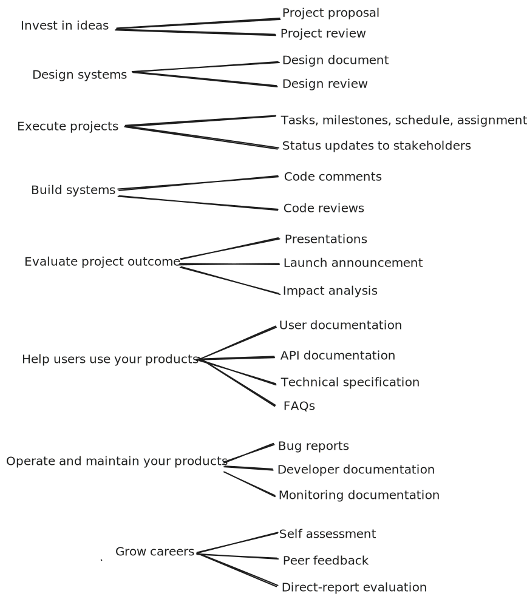

# Technical Communication
## Essential Skills for CS Success

**College-Wide Learning Outcome**

*The ability to engage effectively in verbal, non-verbal, written, and/or symbolic expression*

---

## Learning Objectives

### By the end of this session, you will understand:

1. **Communicate** purpose, theme, or central message
2. **Account** for audience and context  
3. **Follow** disciplinary conventions
4. **Utilize** supporting materials/sources and evidence

<!-- Speaker notes:
- Ask students to self-assess their current communication skills (1-5)
- These objectives apply to ALL forms of CS communication
-->

---

## Why Communication Matters in CS

> ## Clear communication ⟺ Clear thinking

**If you can't explain it simply, you don't understand it well enough**

<!-- Speaker notes:
- This Einstein quote resonates strongly in technical fields
- Communication is bidirectional with understanding
-->

---

## Communication Scenarios in CS Careers



---

## 🤔 **Reflection Activity** (2 min)

### Think-Pair-Share:

1. **Think**: One time poor communication caused a problem in your CS work
2. **Pair**: Share with your neighbor
3. **Share**: Volunteer examples for the class

*What could have been done differently?*

---

# Objective 1
## Communicate Purpose, Theme, or Central Message


---

## The What-Why-How Framework

| Element  | Purpose                     | Key Question         |
| -------- | --------------------------- | -------------------- |
| **WHAT** | State what you built/solved | "What is it?"        |
| **WHY**  | Explain why it matters      | "Why should I care?" |
| **HOW**  | Brief technical approach    | "How does it work?"  |

---

## Example: Elevator Pitch

### ❌ **Bad Example**
*"So, um, my project uses React and Node.js with MongoDB. I implemented JWT authentication and used Redux for state management. There's also a REST API with 15 endpoints..."*

### ✅ **Good Example**  
*"I built an app that helps college students save 30% on textbooks by connecting them directly for exchanges. Think of it as 'Uber for textbook sharing.' In our pilot, we saved students $15,000."*

<!-- Speaker notes:
- Bad: All technical details, no value proposition
- Good: Clear problem, solution, impact
-->

---

## Quick Examples: Clear Purpose

<div style="font-size: 24px;">

| Context            | Bad                 | Good                                           |
| ------------------ | ------------------- | ---------------------------------------------- |
| **Code Comment**   | `// Processes data` | `// Prepares data for statistical analysis`    |
| **Commit Message** | `Fixed stuff`       | `Fix: DB connection leak (Bug #1648)`          |
| **Email Subject**  | `Update`            | `URGENT: DB connection leak - Action required` |
| **Bug Report**     | `Button problem`    | `[CRITICAL] Payment button fails silently`     |

</div>

---

## 🎯 **Practice: Elevator Pitch** (5 min)

### Your turn! Create a 30-second pitch:

1. Pick your current/recent project
2. Apply What-Why-How:
   - **WHAT**: One sentence description
   - **WHY**: Problem solved + impact
   - **HOW**: Key technical approach
3. Practice with a partner

---

# Objective 2
## Account for Audience and Context

**One size does NOT fit all**

---

## Tailoring to Your Audience

### Consider:
- **Technical level**: How much do they know?
- **Primary concerns**: What keeps them up at night?
- **Preferred format**: Email? Slack? Document?
- **Time available**: 30 seconds or 30 minutes?
- **Cultural context**: Formal? Casual? Direct?

<!-- Speaker notes:
- Show YouTube video: Explaining concepts at 5 levels
- Link: https://www.youtube.com/watch?v=Vp570S6Plt8
-->

---

## Scenario: Security Breach
### Same Information, Different Audiences

You discovered a SQL injection vulnerability that exposed customer data.

How do you communicate this to:
1. Fellow engineers?
2. Your manager?
3. Customer service team?
4. The public?

---

## Audience 1: Fellow Engineers

**Context**: Slack #engineering  
**Tone**: Technical, solution-focused

```
@channel SECURITY ALERT - SQL Injection in User Login

**Vulnerability Details:**
- Location: AuthController.java line 142
- Issue: Raw string concatenation in SQL query
- Attack vector: username = "admin' OR '1'='1' --"
- Fix: Parameterized queries deployed to prod
```

---

## Audience 2: Your Manager

**Context**: Email  
**Tone**: Impact-focused, professional

```
Subject: Security Incident Report - Resolved

Executive Summary:
We identified and patched a critical security vulnerability 
that potentially exposed customer credentials.

Business Impact:
- Affected users: ~50,000
- Downtime for fix: 0 minutes
- Compliance: GDPR notification required

Next Steps: Legal review, customer communication...
```

---

## Audience 3: Customer Service

**Context**: Team guide  
**Tone**: Clear, supportive

```markdown
# Customer Support Guide

## If customer asks "Was my account hacked?"
"We found and fixed a security vulnerability before 
any misuse was detected. As a precaution, we're asking 
some customers to reset passwords. Payment info was 
NOT affected."

## Escalation Path:
- Angry customers → Team Lead
- Technical questions → security@company
```

---

## Audience 4: The Public

**Context**: Social media  
**Tone**: Transparent, brief

```
We recently discovered and fixed a security issue 
affecting some user accounts. No payment info 
was compromised.

What we're doing:
✅ Issue fixed immediately
✅ Affected users being notified
✅ Password resets as precaution

More: [link]
```

---

## 🎭 **Activity: Audience Adaptation** (8 min)

### Scenario: Your AI chatbot gave bad medical advice

**Write 3 versions** (2 sentences each):
1. **Technical team** (debug the issue)
2. **Hospital admin** (your client)  
3. **News reporter** (interview response)

**Share**: Read one version, class guesses the audience

---

# Objective 3
## Follow Disciplinary Conventions

**When in Rome... code as the Romans code**

---

## CS Writing Conventions

### Key Areas:
- **Style Guides**: Google, organization-specific
- **Documentation**: Javadoc, JSDoc, docstrings
- **Papers**: IEEE/ACM format
- **Code**: Naming conventions, formatting
- **Version Control**: Commit message formats

<!-- Speaker notes:
- Show actual examples of each
- Emphasize consistency over perfection
-->

---

## Example: Javadoc Convention

```java
/**
 * Calculates the final customer price including tax.
 * 
 * PURPOSE: Ensure consistent pricing across channels
 * 
 * @param basePrice Original price before adjustments
 * @return Final price with 15% tax minus 13% discount
 * @throws IllegalArgumentException if price negative
 * 
 * Example:
 *   calculatePrice(100.00) returns 130.50
 */
public double calculatePrice(double basePrice) {
    // Implementation...
}
```

---

## Research Paper Structure (IEEE/ACM)

<div class="cols">
<div>

### Standard Sections:
1. Abstract (150-250 words)
2. Introduction
3. Related Work
4. Methodology/Design
5. Implementation
6. Evaluation/Results
7. Discussion
8. Conclusion
9. References

</div>
<div>

### Abstract Formula:
- Problem (1-2 sentences)
- Gap/Challenge (1 sentence)
- Your approach (2-3 sentences)
- Results/Impact (1-2 sentences)

</div>
</div>

---

## RFC (Request for Comments) Style

```markdown
1. Introduction
   1.1. Problem Statement
   1.2. Scope
   
2. Requirements
   2.1. MUST have
   2.2. SHOULD have
   2.3. MAY have

3. Proposed Solution
   3.1. Architecture
   3.2. Implementation Details
   
4. Security Considerations
5. References
```

*Example: IETF RFCs for Internet standards*

---

# Objective 4
## Utilize Supporting Materials & Evidence

**Show, don't just tell**

---

## Citations in CS

### IEEE Citation Style (Most Common)

**In-text**: Use bracketed numbers [1], [2], [3]

**Reference list**:
```
[1] A. Smith and B. Jones, "Fast consensus in 
    distributed systems," in Proc. ICDCS, 
    Las Vegas, NV, USA, Jun. 2023, pp. 234-245.

[2] GitHub, "TensorFlow," 2023. [Online]. Available: 
    https://github.com/tensorflow/tensorflow. 
    [Accessed: Oct. 15, 2023].
```

---

## Data Visualization: Choose Wisely

| Data Type                 | ✅ Good Choice | ❌ Bad Choice |
| ------------------------- | ------------- | ------------ |
| **Performance over time** | Line graph    | Pie chart    |
| **Parts of whole**        | Stacked bar   | 3D pie       |
| **Correlation**           | Scatter plot  | Bar chart    |
| **Distribution**          | Histogram     | Pie chart    |
| **Comparison**            | Bar chart     | Area chart   |

*Remember: Every pixel should convey information*

---

## Example: Algorithm Performance

### ❌ **Bad: Pie Chart**
```
Algorithm Speed:
- Bubble Sort: 35%
- Quick Sort: 15%
- Merge Sort: 20%
```
*Percentages of what? No context!*

### ✅ **Good: Line Graph**
```
Time (ms) vs Input Size (log scale)
Shows O(n²) vs O(n log n) clearly
Actual measurements with units
```

---

## Quantitative Evidence

### ❌ **Vague**
*"This technology made the website faster"*

### ✅ **Specific**
*"This technology reduced the 99th percentile page load time by **75%** (from 1200ms to 300ms), improving user retention by **18%**"*

**Always include**:
- Specific metrics
- Before/after comparison
- Impact on business/users

---

## 📊 **Activity: Evidence Makeover** (5 min)

### Transform these vague statements:

1. "Our app is popular"
2. "The algorithm is efficient"
3. "Users like the new feature"

**Make them specific with**:
- Numbers/percentages
- Time frames
- Comparisons
- User impact

---

## Putting It All Together

### The Communication Checklist:

- [ ] **Purpose clear** in first 10 seconds?
- [ ] **Audience appropriate** language/detail?
- [ ] **Conventions followed** for the format?
- [ ] **Evidence supports** all claims?
- [ ] **Action items** clear (if needed)?

*Use for every email, document, presentation*

---

## 📚 Recommended Resources

<div class="columns">
<div>

### Books:
- **"Write for your Life"** - Wheelan
- **"The Elements of Style"** - Strunk & White
- **"The Sense of Style"** - Pinker

</div>
<div>

### Online:
- Google Style Guides
- IEEE Author Center
- Writing for Computer Science (Zobel)
- Purdue OWL

</div>
</div>

---

## Key Takeaways

1. **Clear communication = Clear thinking**
2. **What-Why-How** structures your message
3. **Know your audience** and adapt accordingly
4. **Follow conventions** of your field
5. **Support with evidence**, not opinions

*These skills differentiate good engineers from great ones*

---


