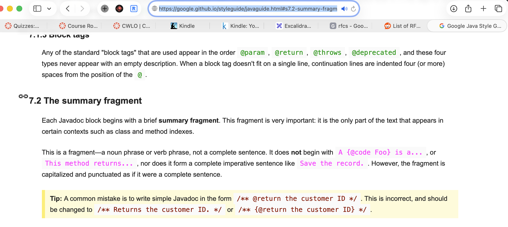
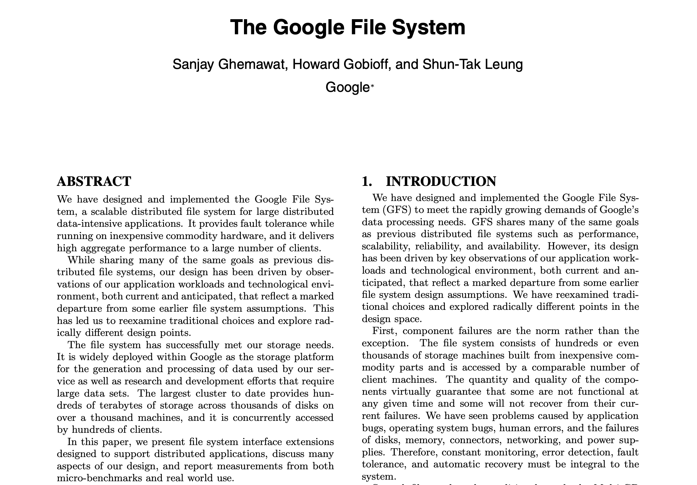
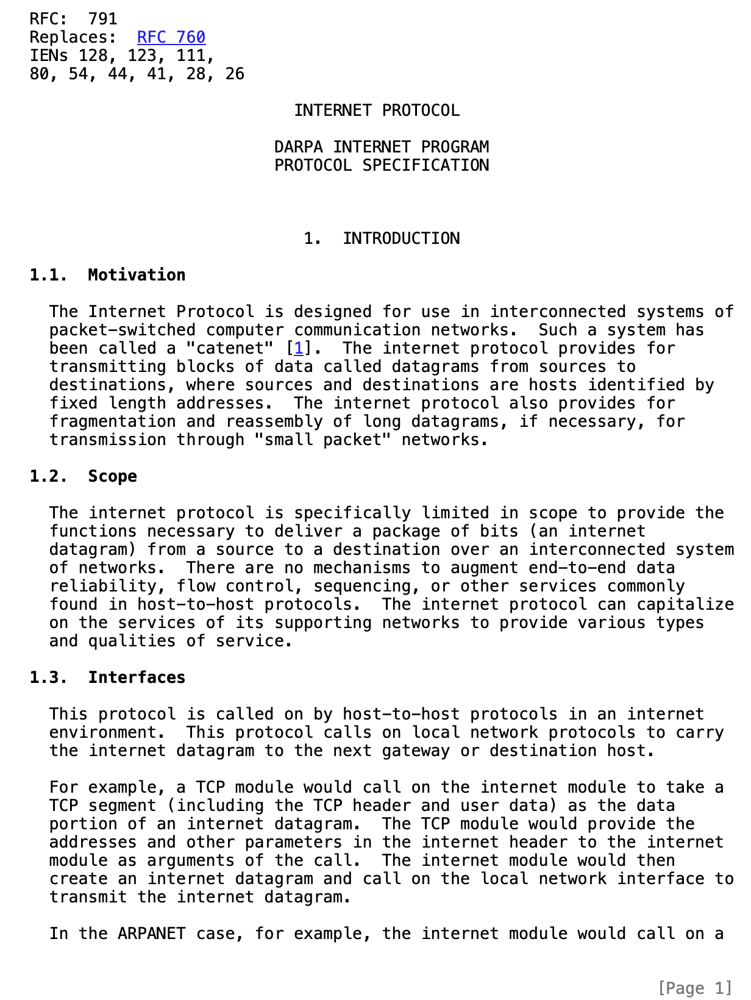
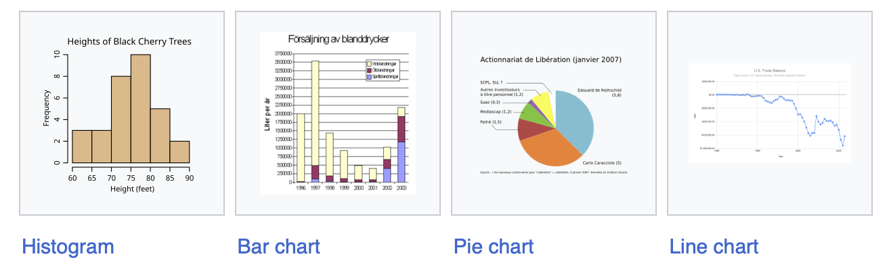
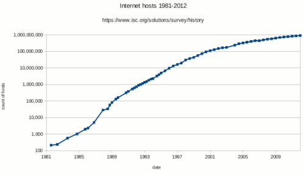
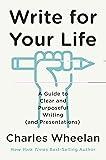

# Communication

## College-wide Learning Outcome (CWLO)

### Definition

> The ability to engage effectively in verbal, non-verbal, written, and/or symbolic expression.

### Objectives

1. Communicate purpose, theme, or central message
2. Account for audience and context
3. Follow disciplinary conventions
4. Utilize supporting materials/sources and evidence

## Relevance In CS Careers

> Clear communication <=> Clear thinking


Reflection:

- Have you encountered any of the above scenarios?
- Have you encountered other scenarios that required good communication?
- Can you imagine other scenarios?

## Objective 1: Communicate Purpose, Theme, or Central Message

- Framework

  | Element  | Purpose                     | Key Question         |
  | -------- | --------------------------- | -------------------- |
  | **WHAT** | State what you built/solved | "What is it?"        |
  | **WHY**  | Explain why it matters      | "Why should I care?" |
  | **HOW**  | Brief technical approach    | "How does it work?"  |

- Examples

|                                              | Bad                                                          | Good                                                         |
| -------------------------------------------- | ------------------------------------------------------------ | ------------------------------------------------------------ |
| **Elevator pitch** e.g. explain your project | "So, um, my project uses React and Node.js with MongoDB. I implemented JWT authentication and used Redux for state management. There's also a REST API with 15 endpoints. I used Docker for containerization and deployed it on AWS EC2. The frontend has 12 components and I wrote 200 unit tests. Oh, and I used GitHub Actions for CI/CD..." | "I built an app that helps college students save 30% on textbooks by connecting them directly for exchanges. Think of it as 'Uber for textbook sharing.' Students post books they're done with, others request them, and they meet on campus to swap or sell. In our pilot with 100 students, we saved them $15,000 total last semester. The technical challenge was building a real-time matching algorithm that considers location, class schedules, and book condition." |
| **Code documentation**                       | // Processes data.<br />public void processData(String data) {...} | // Prepares the data for statistical analysis.<br />public void processDataForAnalysis(String data) {...} |
| **Email**                                    | Subject: Update<br /><br />I was looking at our code yesterday and noticed some things. The database connections aren't closing properly... | Subject: URGENT: DB connection leak - Action required<br /><br />We have a critical database connection leak that needs immediate attention.<br /><br />Impact: System will crash when the connection pool is exhausted.<br /><br />Evidence: Here's the graph of active connections over time, showing the growth...<br /><br />Action needed: .... |
| **Bug report**                               | Title: Button problem                                        | Title: [CRITICAL] Payment Submit button fails silently on click |
| **Code commit message**                      | Fixed stuff                                                  | Fixed bug (ID 1648) that caused DB connection leak           |
| **Design doc intro**                         | We need a new system. Users have been complaining. The old system is slow... | Here's a design proposal to migrate to a microservices architecture. The purpose is to reduce system downtime from 47 hours per month to < 10 minutes per month... |

## Objective 2: Account for Audience and Context

- One size does not fit all
- Communication must be tailored to audience
  - e.g. explaining a technical concept to a manager, peer develor, end-user, investor, etc.
  - e.g. explaining infinity at 5 different levels: [YouTube video](https://www.youtube.com/watch?v=Vp570S6Plt8)
- Often requires "translation"
  - e.g. technical documentation into user manual
  - e.g. academic paper into blog post
- Key considerations
  - Technical vs non-technical audiences
  - Level of detail
  - The "why"
  - Cultural considerations 

### Scenario

> Explaining a security breach in your company's system

#### Audience 1: Fellow Engineers

- Context: Slack message in #engineering channel
- Tone: Direct, technical, solution-focused

```
@channel SECURITY ALERT - SQL Injection in User Login

**Vulnerability Details:**
- Location: `AuthController.java` line 142
- Issue: Raw string concatenation in SQL query
...
```

#### Audience 2: Manager

- Context: email
- Tone: professional, impact-focused

```
Subject: Security Incident Report - Customer Data Exposure Fixed

Hi Sarah,

**Executive Summary:**
We identified and patched a critical security vulnerability that potentially exposed customer login credentials. The issue is now resolved, but we need to discuss customer notification and prevention measures.

**What Happened:**
- Tuesday's deployment introduced a SQL injection vulnerability in our login system
...
```

#### Audience 3: Customer Service Team

- Context: team briefing document
- Tone: clear, supportive, customer-focused

```
# Customer Support Guide: Security Update

## What Customers Need to Know
We discovered and fixed a security issue. Some customers will need to reset their passwords as a precaution.

## Key Messages for Customers

### If customer asks "Was my account hacked?"
"We found and fixed a security vulnerability before we detected any misuse. As a precaution, we're asking some customers to reset their passwords. Your payment information was NOT affected."

...
```

#### Audience 4: The Public

- Context: Twitter/X post
- Tone: transparent, reassuring, brief

```
We recently discovered and fixed a security issue affecting some user accounts. No payment info was compromised. 

What we're doing:
✅ Issue fixed immediately
✅ Affected users being notified
✅ Password resets required as precaution
✅ Full security audit underway

More details: [link]
```


## Objective 3: Follow Disciplinary Conventions

- Follow any **style guides** adopted by your organization
  - e.g. [Google Style Guides](https://google.github.io/styleguide/) for coding
  - Organization-specific **templates** for design docs etc.

- In the absence of style guides:
  - Either be consistent i.e. follow the style of the existing code/docs
  - Or propose/adopt a style
- Use appropriate **technical vocabulary**, tailored to audience
  - e.g. "We used *mergesort* to combine the files into a single file"
- Examples
  - Javadoc style guide
  
  ​	
  
  
  
  - Research papers
  
    
  
  - RFCs
  
    

## Objective 4: Utilize Supporting Materials/Sources and Evidence

### Citations

- Code comments to attribute any adopted code to original creators (respecting license)
- IEEE citation style: https://ieee-dataport.org/sites/default/files/analysis/27/IEEE%20Citation%20Guidelines.pdf

​		**Basic Format: Numbered References**

​		**In-text citation**: Use bracketed numbers ⁠[1], ⁠[2], ⁠[3]

​		**Example in text**:

​			"Recent work in distributed systems [1] shows that consensus algorithms [2], [3] can achieve fault tolerance. Chen et al. [4] extended this work by..."


​		**IEEE Reference List Examples**

​		**Conference Paper**

​		[1] A. Smith and B. Jones, "Fast consensus in distributed systems," 

  in Proc. 35th Int. Conf. Distributed Computing (ICDCS), 

  Las Vegas, NV, USA, Jun. 2023, pp. 234-245.


​		**Journal Article**

​		[2] C. Chen, D. Liu, and E. Wang, "Machine learning for network 

  optimization," IEEE Trans. Neural Netw. Learn. Syst., vol. 34, 

  no. 3, pp. 456-470, Mar. 2023.


​		**Book**

​		[3] M. Williams, Distributed Systems Design, 3rd ed. Cambridge, MA, 

  USA: MIT Press, 2023, pp. 123-145.


​		**Website/Online Resource**

​		[4] GitHub, "TensorFlow: Open source machine learning framework," 

2023. [Online]. Available: https://github.com/tensorflow/tensorflow. 

  [Accessed: Oct. 15, 2023].


### Data

- Use quantitive measures whenever possible

  - "This technology made the website faster" vs "This technology reduced the 99th percentile page load time by a factor of 4 (from 1200 ms to 300 ms)"

- Use appropriate chart-type to present data: https://en.wikipedia.org/wiki/Chart#Common_charts

  

  - Example: algorithm performance comparison

    - Good: line graph

      Title: "Sorting Algorithm Performance: Time Complexity vs Input Size"
      Y-axis: Execution Time (ms) - logarithmic scale
      X-axis: Input Size (number of elements)

            1000ms |     ....● Bubble Sort O(n²)
                    |  ...●    
             100ms |..●      ▲ Heap Sort O(n log n)
                    |●     ▲▲   
              10ms |   ▲▲     ■ Merge Sort O(n log n)
                    |▲■■      ◆ Quick Sort O(n log n) avg
               1ms |■◆________________________________________
                    100    1K     10K    100K    1M
                          Input Size (elements)

    - Bad: pie chart (parts of whole)

      ```
      Title: "Algorithm Speed"
      - Bubble Sort: 35%
      - Quick Sort: 15%  
      - Merge Sort: 20%
      - Heap Sort: 30%
      ```

- Label all units and axes

- Use [log scale](https://en.wikipedia.org/wiki/Logarithmic_scale) when the range of values is large


​	[](https://en.wikipedia.org/wiki/File:Internet_host_count_1988-2012_log_scale.png)

## More

- Recommended books

  

  - Highlights
    1. "Why are you writing this? The first step to good writing is determining what you expect it to accomplish."
    2. "Know your audience. Your writing should be catered to those for whom it is intended."
       - “Never overestimate how much the listeners know about a specific subject, but never underestimate how intelligent they are.”
    3. "Sometimes there is more than one audience. You may need multiple documents to address different stakeholders."
       - "If you are having trouble writing something because there are too many ideas pulling you in different directions, the problem may be foundational: this is not meant to be one document. If you will be giving presentations to these different groups, do not recycle the exact same slides and jokes. Speak to the audience sitting in front of you."
       - "Remember, your objective is not to create a single document with beautiful prose. Your objective is whatever you identified in #1. If that requires multiple documents because engineers love data, state legislators are busy, and the governor has a short attention span, so be it."
    4. "Good writing begins with a clear thesis. The thesis is a succinct articulation of the point or points you are trying to make."
    5. "Organize your thoughts into a coherent narrative structure. Your organizational structure is how you choose to tell your story."
       - "This is perhaps the most underappreciated challenge of writing: there are an infinite number of ways to tell any story."
    6. "Make an outline. The outline is a blueprint for your document."
       - "In fact, with a good outline, you don’t even have to start writing at the beginning. If you know what each piece looks like and where it goes, you can work on them independently and then stick them together later, like Legos. In fact, this is a nice indicator of whether you are ready to begin writing: Am I sufficiently comfortable with my outline that I could begin writing anywhere in the document and still know how it will turn out?"
    7. "Now write complete sentences. Once you have a clear thesis and a good outline, it is time to begin writing."
    8. "Use paragraphs as the building blocks of your document. Each important idea deserves its own paragraph."
    9. "Get the grammar right. Grammar is the set of rules that allows us to organize language, like traffic laws for words."
    10. "Aspire to be clear; avoid inappropriate jargon. Good writers and speakers communicate in ways that make them understood."
        - "Here is an excerpt from the The Economist Style Guide: “The first requirement of The Economist is that it should be readily understandable. Clarity of writing usually follows clarity of thought. So think what you want to say, then say it as simply as possible.”"
    11. "Always be framing. Framing is the use of strategic language to provoke an emotional response."
    12. "Give credit where credit is due. Identify the source for any thought, idea, photo, graph, or fact that was generated by someone else."
    13. "When working in a group, create a process that shares the workload and gathers input from all participants while still producing a coherent document. Something written by a group should not read like it was written by a group."
    14. "The first draft is about getting all the important ideas down with grammatically correct sentences and a structure that works. The clunky but essential first draft can be edited later into something sharper, tighter, and better."

  - https://en.wikipedia.org/wiki/The_Elements_of_Style
  - https://en.wikipedia.org/wiki/The_Sense_of_Style
