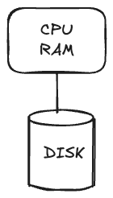
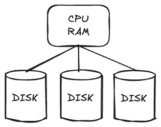
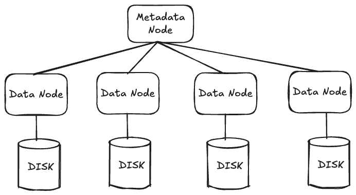
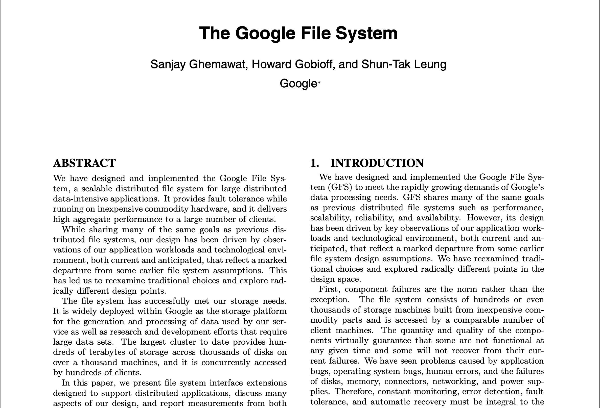

# Distributed File Systems

**Managing Big Data Storage at Scale**

---

## Big Data Storage Requirements

- **Volume**: Large capacity + low cost per byte
- **Velocity**: Efficient streaming reads/writes ("batch" vs "point" access)
- **Variety**: Store unstructured/semi-structured data
- **Concurrency**: Coordinate concurrent access without expensive transactions

**Bottom line:** We need a file system (FS) that can handle these requirements

---

## Local File System Architecture

Single machine with CPU/RAM and attached storage

*Can we just add more disks?*

---

## Scaling Local FS

**Problems:**
1. Limit on storage one machine can drive
2. Limit on request traffic one machine can handle:
   - CPU for request processing
   - RAM for disk buffers
   - Network interface for data transmission

❌ **Local FS cannot handle Big Data Volume and Velocity**

---

## Distributed File System Architecture

- **Data nodes**: Store actual file content
- **Metadata node**: Tracks which data is stored where

---

## Addressing the Metadata Bottleneck

**Question:** Have we just moved the bottleneck from data node → metadata node?

**Answer:** No! Here's why:

1. **Infrequent metadata access**
   - Clients consult metadata node only when opening files
   - Clients cache metadata locally

2. **Separate control and data paths**
   - Metadata node: Control path only
   - Data nodes: Direct data transfer with clients
   - Metadata node NOT in the data path!

---

## GFS/HDFS: The Pioneers

**Historical Context:**
- **GFS** (Google File System): 2003
  - Now replaced by Colossus File System (CFS)
- **HDFS** (Hadoop Distributed File System)
  - Open source version of GFS

---

## GFS/HDFS Architecture Overview

---

## Design Goal 1: High Volume

**Strategies:**

1. **Multiple data nodes** → increased capacity
2. **Commodity hardware** → reduced cost
3. **Redundancy** → handle failures
   - Commodity hardware more likely to fail
   - **Replication (R=3)**: Simple but costly
   - **Erasure coding (5,3)**: Same fault-tolerance (2 losses) at ~half the storage cost
4. **"Repair" plane** → re-replicate on failures

---

## Design Goal 2: High Velocity (Part 1)

**Large block size: 64 MiB** (vs 4 KiB in local FS)

**Benefits:**
1. **Fewer blocks per file**
   - Reduced metadata (can stay in memory!)
   - Lower metadata node traffic

2. **Higher effective throughput**
   - Amortize seek time over larger reads

---

## Block Size Impact on Throughput

**Example:** 1 ms seek + 1 KiB/ms disk read speed

| Block Size | Time to Read 1 Block | Effective Throughput |
|------------|---------------------|---------------------|
| 4 KiB      | (1 + 4) ms = 5 ms   | 80%                |
| 64 MiB     | (1 + 2¹⁶) ms ≈ 65 sec | ~100%            |

**Key insight:** With large blocks, seek time becomes negligible!

---

## Design Goal 2: High Velocity (Part 2)

**Additional velocity benefits:**

3. **Reduced wasted storage**
   - Small file in 64 MiB block seems wasteful...
   - But GFS/HDFS designed for *large files*
   - Wasted space is minimal in practice

4. **Redundancy enables parallel reads**
   - Multiple replicas → read from multiple nodes
   - Further increases effective throughput

---

## Design Goal 3: High Concurrency

**Write-Once-Read-Many (WORM) model**
- Simplifies concurrency management
- No need for complex locking protocols

**Novel append semantics:**
- **Traditional FS**: Specify file offset → concurrent appends not serializable
- **GFS/HDFS**: No offset specification → metadata node serializes appends
- Enables concurrent appends without conflicts!

---

## Key Takeaways

1. **Local FS can't scale** for Big Data (Volume + Velocity limits)

2. **Distributed FS separates concerns**: 
   - Metadata management vs. data storage
   - Control path vs. data path

3. **GFS/HDFS design optimizations:**
   - Large blocks for batch access
   - Replication/erasure coding for fault tolerance
   - WORM + novel appends for concurrency

4. **Design for common case**: Large files, sequential access, append-only

---

## Further Reading

📄 **Recommended Paper:**
[The Google File System](https://static.googleusercontent.com/media/research.google.com/en//archive/gfs-sosp2003.pdf) (GFS, 2003)

- Foundational distributed systems paper
- Clear explanation of design decisions
- Real-world performance data
- Great example of systems thinking

---
