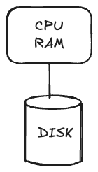
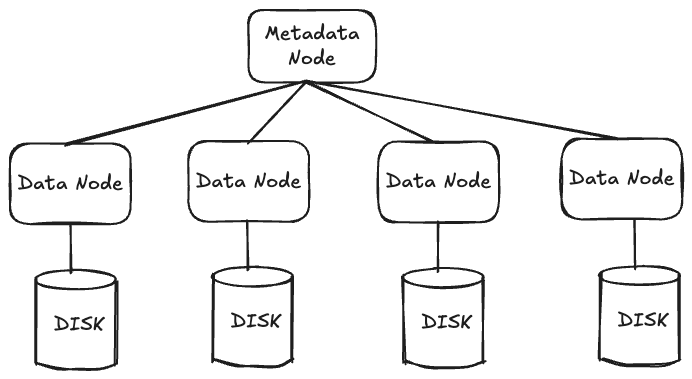
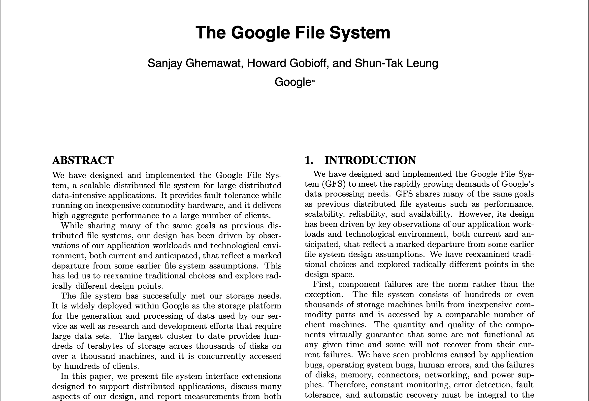

# Distributed File Systems

## Overview

- Data storage requirements for Big Data
  - Volume: need large **capacity** and low **cost** per stored byte
  - Velocity: need to efficiently read and write **streams** of data
    - "batch" access instead of "point" access
  - Variety: need to store **unstructured**/semi-structured data
  - Concurrency: need to coordinate **concurrent access** to the same data without expensive transactions
- A file system (**FS**) is needed, either to directly store unstructured data, or to use as a storage layer for a DB system
- But a local (single-machine) file system doesn't cut it

## Local FS

- Single machine with CPU/RAM and attached storage

    

- Increase storage capacity by adding more disk?

    

- But:
  1. Limit on how much storage one machine can drive
  2. Limit on how much request traffic one machine can handle
     1. CPU for request processing
     2. RAM for disk buffers
     3. Network interface for transmitting data
- So a local FS can't handle the Volume and Velocity of Big Data

## Distributed FS

- Many storage machines (data nodes) with a manager machine (metadata node) that places and tracks which data is stored where

    

---

- Have we just swapped the choke-point of a single data node (as in a local FS) with a single metadata node in a distributed FS?

- No! How come?
    1. Clients consult the metadata node infrequently e.g. when opening a file
       1. Also, clients cache metadata
    2. Clients use the metadata to directly access data nodes for data transfer (metadata node is only in the *control* path, not in the *data* path)

### GFS/HDFS

- Pioneers of distributed FS
    - [The Google File System](https://static.googleusercontent.com/media/research.google.com/en//archive/gfs-sosp2003.pdf) (GFS): 2003
        - Now replaced by the Colossus File System (CFS)
    - [Hadoop Distributed File System](https://hadoop.apache.org/docs/r1.2.1/hdfs_design.html) (HDFS)
      - an open source version of GFS

- How do they work?

    

1. High volume
   1. Multiple data nodes to increase capacity
   2. Commodity hardware to reduce cost
   3. Redundancy to handle failures
      1. Commodity hardware more likely to fail
      2. R=3 is simple but costly
      3. (5, 3) erasure code provides same fault-tolerance (2 losses) at almost half the storage cost
   4. "Repair" plane to re-replicate on failures

 2. High velocity
    1. Optimized for batch access of large files: large default **block size** of 64 MiB (c.f. 4 KiB in a typical local FS)
       1. Fewer blocks per file
          1. Reduced metadata (can be kept in memory)
          2. Lower traffic on the metadata node (reduced risk of a choke-point)
       2. Higher effective throughput
          1. Example 1 ms seek followed by a block read on a 1 KiB / ms disk

             | Block size | Time to read 1 block | Effective Throughput |
             | ---------- | -------------------- | -------------------- |
             | 4 KiB      | (1 + 4) ms           | 80%                  |
             | 64 MiB     | (1 + $2^{16}$) ms    | ~100%                |
       3. Risk of wasted storage mitigated due to large file sizes
             1. Otherwise a small file would take up 1 block of storage 
    2. Redundancy (replication or erasure-coding) further increases effective throughput of reads

 3. High concurrency
    1. Write-once-read-many times (WORM)
       1. Simplifies concurrency management
    2. Non-standard append semantics
       1. Traditional: specify file offset => concurrent appends not serializable
       2. GFS: No offset => metadata node serializes concurrent appends

---

- If you're interested in more details, the [GFS paper](https://static.googleusercontent.com/media/research.google.com/en//archive/gfs-sosp2003.pdf) is a good read

