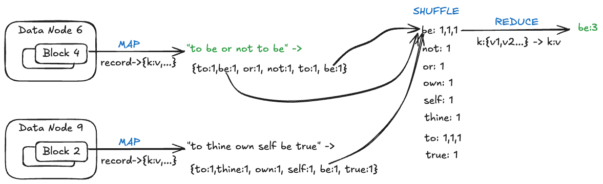

# MapReduce
## A Framework for Big Data Processing

---

## The Big Data Challenge

**We can store Big Data in distributed file systems...**
- Handle **volume** (large amounts of data)
- Handle **velocity** (fast data ingestion)

**But how do we analyze it?**
- Deal with **variety** (unstructured data)
- Extract meaningful insights

---

## The Brute Force Approach: Full Scan

**Example:** Searching for a log entry in AWS S3
- Problem: Find a particular request's log entry
- Solution: Full scan of all logs
- Result: **Ran overnight!** 😴

**Can we do better?**

---

## Speeding Up: Parallel Processing

**Idea:** Use multiple processes scanning different data shards
- Each process scans a file block on a data node
- Minutes instead of hours/days! ⚡

**Use cases:**
- Searching for particular data
- Filtering data

**But:** Need infrastructure to:
- Set up multiple processes
- Coordinate data sharding

---

## What About More Complex Operations?

**Examples of aggregate operations:**
- Total number of requests per day for each customer
- Total units sold for each product on invoices

**Traditional approach:**
- Write a custom distributed program for each problem
- Complicated, time-consuming, and error-prone

**There must be a better way!**

---

## The Analogy: Filesystems vs DBMS

**Filesystem:**
- Extract information → write custom program for each use case
- Tedious and repetitive

**DBMS:**
- Provides general infrastructure
- Supports different use cases with minimal effort
- SQL queries instead of custom programs

**We need something similar for Big Data!**

---

## Introducing MapReduce

> **MapReduce** provides a general-purpose infrastructure and programming framework to process large data sets with minimal effort

**Key Benefits:**
- Write simple Map and Reduce functions
- Infrastructure handles distribution, coordination, fault tolerance
- Focus on **what** to compute, not **how** to distribute

---

## Case Study: Word Count

**Real-world project:** Distributed word-frequency counter for Shakespeare's plays
- Students build coordinator-volunteers system
- Count word frequencies across all plays
- Requires significant implementation effort

---


---

**Question:** Can MapReduce simplify this?

**Answer:** Yes! Dramatically!

---

## Word Count with MapReduce



**Your job:** Code the Map function and Reduce function
**MapReduce infrastructure handles:** Everything else!

---

## MapReduce Word Count: The Code

```java
public class Main {
    public static void main(String[] args) {
        Mapper<String, Integer> mapper = (String line, Consumer<Entry<String, Integer>> consumer) -> {
            for (String word : line.split(" ")) {
                word = word.toLowerCase();
                consumer.accept(Map.entry(word, 1));
            }
        };
        
        Reducer<String, Integer> reducer = (String key, Collection<Integer> values, Consumer<String> consumer) -> {
            int sum = 0;
            for (int v : values) {
                sum += v;
            }
            consumer.accept(key + ": " + sum);
        };
        
        Spec<String, Integer> spec = new Spec<>("java/src/examples/data",
                mapper, reducer, "java/src/examples/wordcount");
        Runner<String, Integer> runner = new Runner<>(spec);
        runner.run();
    }
}
```

---

## Breaking Down the Map Function

```java
Mapper<String, Integer> mapper = (line, consumer) -> {
    for (String word : line.split(" ")) {
        word = word.toLowerCase();
        consumer.accept(Map.entry(word, 1));
    }
};
```

**What it does:**
1. Takes a line of text as input
2. Splits into individual words
3. Converts to lowercase (normalization)
4. Emits each word with count of 1: `(word, 1)`

---

## Breaking Down the Reduce Function

```java
Reducer<String, Integer> reducer = (key, values, consumer) -> {
    int sum = 0;
    for (int v : values) {
        sum += v;
    }
    consumer.accept(key + ": " + sum);
};
```

**What it does:**
1. Receives a word (key) and all its counts (values)
2. Sums up all the counts
3. Outputs: `word: total_count`

---

## 💡 Active Learning: Trace the Execution (3 minutes)

**Input text:**
```
The quick brown fox
The lazy dog
```

**Task:** Work through what the Map and Reduce functions produce

1. What key-value pairs does the Mapper emit?
2. How are they grouped before Reduce?
3. What does the Reducer output?

---

## Solution: Trace the Execution

**Mapper output:**
```
(the, 1), (quick, 1), (brown, 1), (fox, 1)
(the, 1), (lazy, 1), (dog, 1)
```

**After grouping (by key):**
```
the: [1, 1]
quick: [1]
brown: [1]
fox: [1]
lazy: [1]
dog: [1]
```

**Reducer output:**
```
the: 2, quick: 1, brown: 1, fox: 1, lazy: 1, dog: 1
```

---

## MapReduce Playground

[Example Code](/java/src/mapreduce/examples/wordcount/Main.java)

**Available for experimentation:**
- Java-based MapReduce framework
- Runs on a single machine
- No distributed infrastructure needed

**Purpose:**
- Learn MapReduce concepts
- Experiment without setup complexity
- Focus on Map/Reduce logic

**For production:** Use [Hadoop MapReduce](https://hadoop.apache.org/docs/r1.2.1/mapred_tutorial.html)

---

## Use Cases: One-Off Jobs

**Ad-hoc analysis tasks:**

**Example: Grep across logs**
- Service handling millions of queries per second (qps)
- Search for specific patterns across all request logs
- Quick insights without building custom tools

**Other examples:**
- Find all errors in the last 24 hours
- Extract user behavior patterns
- Identify anomalies in system metrics

---

## Use Cases: Production Systems

**Google Maps Generation**
- **Input:** Geo features (roads, buildings, restaurants)
- **Output:** Vector drawing instructions for map tiles
  - Zoom 0: one tile for the entire world
  - Zoom 1: divide into 4 tiles
  - Each zoom level multiplies tiles by 4

**SaaS Billing System**
- **Input:** Request logs from all customers
- **Output:** Per-customer bills based on API usage
- Process millions of requests to generate accurate invoices

---

## Key Takeaways

1. **Problem:** Analyzing Big Data requires custom distributed programs
2. **Solution:** MapReduce provides reusable infrastructure
3. **Your job:** Write Map and Reduce functions
4. **Framework handles:** Distribution, coordination, fault tolerance
5. **Result:** Focus on logic, not infrastructure

---
