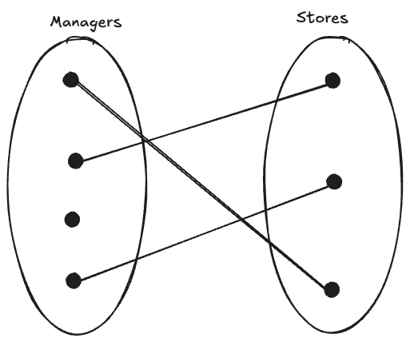

# Data Modeling

## Building the Blueprint for Your Database

---

# Learning Objectives

By the end of this session, you will be able to:

- Explain why data modeling is essential for database design
- Identify the four building blocks of data models
- Apply business rules to create data models
- Compare different data modeling notations
- Analyze the evolution from relational to Big Data models

---

# Context

## Why do we need databases?

- **Data is everywhere** 📊
- Traditional file systems have critical limitations:
  - **Redundancy**
    - **Poor integrity (anomalies)**
    - **Security issues** 🔒
    - **High costs** 💰
  - **Structural & data dependencies**

---

# Context (continued)

## Database Management System

**DBMS** = Logically related data in a single logical repository

### Core Functions:

<div class='cols'>
<div>

- Data dictionary
- Data storage
- Data transformation
- Security

</div>
<div>

- Concurrency control
- Backup & recovery
- Data integrity
- SQL & APIs

</div>
</div>

---

# Context (continued)

- Tease apart entities and minimize redundancies using the **normalization** process
  
| Normal Form | Characteristic                               |
| ----------- | -------------------------------------------- |
| **1NF**     | Table format, no repeating groups, PK chosen |
| **2NF**     | 1NF + no partial dependencies                |
| **3NF**     | 2NF + no transitive dependencies             |

**Key Question:** 
> Can we design our data model up front to control redundancies instead of always normalizing after the fact?

---

# What is Data Modeling?

## Creating a Blueprint

<div class='cols'>
<div>

- **First step** in database design
- **Simple representation** (usually graphical) of complex real-world data
- An **abstraction** of a real-world problem domain

</div>
<div>


</div>
</div>

---

# What is Data Modeling? (continued)

<div class='cols'>
<div>


</div>
<div>

- Holistic view vs. department view
- Multiple "correct" models possible
- Progressive refinement

</div>
</div>

---

# 🏗️ The Four Building Blocks

## Foundation of Every Data Model

1. **Entity** 👤
2. **Attribute** 📝
3. **Relationship** 🔗
4. **Constraint** ⚠️

---

# Building Block 1: Entity

## What is an Entity?

- A person, place, thing, concept, or event
- Data will be collected and stored about it
- Represents a **unique object** in the real world

### Examples:
- Physical: `STUDENT`, `BUILDING`, `PRODUCT`
- Abstract: `FLIGHT_ROUTE`, `COURSE`, `APPOINTMENT`

---

# Building Block 2: Attribute

## Characteristics of an Entity

- Describes a specific property of an entity

### Examples:
- For `STUDENT` entity:
  - `STU_EMAIL`
  - `STU_FNAME`
  - `STU_LNAME`
  - `STU_GPA`

---

# Building Block 3: Relationship

## Associations Among Entities

### Three Types:

1. **One-to-Many (1:M)**
2. **Many-to-Many (M:N)**  
3. **One-to-One (1:1)**

---

# One-to-Many Relationships (1:M)

<div class='cols'><div>


</div><div>

**Example:** A painter creates many paintings, but each painting has only one painter

**Remember:** Relationships are bidirectional!
 1.  **one** *painter* paints **many** *paintings*
 2. **one** *painting* is painted by **one** *painter*

</div></div>

---

# Many-to-Many Relationships (M:N)

<div class='cols'><div>


</div><div>

**Example:** 
1. **One** *student* takes **many** *classes*
2. **One** *class* has **many** *students*

</div></div>

---

# One-to-One Relationships (1:1)

<div class='cols'><div>



</div><div>

**Example:** 
1. **One** *store* has **one** *manager*
2. **One** *manager* manages **one** *store*

</div></div>

---

# 🎯 Activity: Identify Relationships

**Think-Pair-Share (3 minutes)**

For each scenario, identify the relationship type:

1. A doctor treats patients
2. An employee has a parking space
3. Authors write books
4. A country has a capital city

*Share your answers with a partner!*

---

# Building Block 4: Constraint

## Rules That Restrict Data

- Enforces data integrity
- Ensures business rules are followed

### Examples:
- Student GPA must be between 0.0 and 4.0
- Course enrollment minimum: 5 students
- Employee age must be ≥ 18

---

# Business Rules

## The Foundation of Your Model

> **Business Rule** = A brief, precise, and unambiguous description of a policy, procedure, or principle

### Purpose:
- Define entities, attributes, relationships, and constraints
- Make data meaningful
- Reflect organizational reality

---

# Business Rules Example

## Organization: LWTech College

**Rules:**
1. A student can take 1-3 classes per quarter
2. A class must have at least 5 students

**Resulting Model:**
- Entities: `STUDENT`, `CLASS`
- Relationship: Many-to-Many
- Constraints: Min/max enrollment limits

---

# Determining Relationships

## The Two Key Questions

To find the relationship between entities A and B:

1. **How many instances of B** are related to one instance of A?

2. **How many instances of A** are related to one instance of B?

💡 These questions reveal the relationship type!

---

# Naming Conventions

## Best Practices

### Entity Names:
- Singular form
- Descriptive
- Examples: `STUDENT`, `CUSTOMER`, `ORDER`

### Attribute Names:
- Prefix with entity abbreviation
- Descriptive
- Examples: `STU_LNAME`, `CUST_EMAIL`, `ORD_DATE`

---

# 📝 Exercise: Business Rules

**Individual Work (5 minutes)**

Scenario: *A patient takes medications prescribed by doctors*

Write business rules that govern the relationships between:
- `PATIENT`
- `PRESCRIPTION`  
- `DOCTOR`

Consider: Who prescribes? Who takes? How many?

---

# Evolution of Data Models


From simple files to Big Data solutions

---

# The Relational Model (1970)

## E.F. Codd's Breakthrough


**Like shifting from manual to automatic transmission!**

---

# Relational Model: Key Ideas

<div class='cols'><div>

## 1. Based on Relational Algebra

- Relations = **Tables**
- Rows = **Tuples** (entities)
- Columns = **Attributes**

</div><div>

## 2. Common Attributes Link Tables


</div></div>

---

# RDBMS Components

## Relational Database Management System

### Three Main Parts:

1. **End-user interface**
   - How users interact with data

2. **Collection of tables**
   - All data stored in table format

3. **SQL engine**
   - Executes queries behind the scenes

Examples: Oracle, MySQL, SQL Server, PostgreSQL

---

# Entity Relationship Model (1976)

## Peter Chen's Enhancement

- Adds **graphical representation** to relational model
- Introduces **Entity Relationship Diagrams (ERD)**
- Makes design more visual and intuitive

**Connectivity** = Relationship type (1:1, 1:M, M:N)

---

# ERD Notations


Three popular notations for drawing ERDs

---

# Chen Notation

<div class='cols'><div>

## The Original

- Connectivity written next to entity box
- Diamond shape represents relationships
- Clear but can be verbose

</div><div>


</div></div>

---

# Crow's Foot Notation

<div class='cols'><div>

## The Modern Standard

### Symbols:
- ○ = Zero (optional)
- | = One (mandatory)
- ⟨ = Many (crow's foot)

```


</div><div>


</div></div>

---

# UML Notation

<div class='cols'><div>

## Object-Oriented Approach

- Uses min..max format (1..1, 1..*, 0..*)
- Labels both sides of relationship
- Popular in software engineering

</div><div>


</div></div>

---

# 🎨 Activity: Create an ERD

**Group Exercise (10 minutes)**

Scenario: *A patient takes medications prescribed by doctors*

1. Identify entities
2. Determine relationships
3. Draw using Crow's Foot notation
4. Compare with another group

---

# The Big Data Challenge

## The 3 V's

### 📊 **Volume**
Amount of data being stored

### ⚡ **Velocity**
Speed of data processing needed

### 🔀 **Variety**
Multiple, loosely-structured formats

*RDBMS struggles with all three!*

---

# Big Data Solutions

## New Paradigms

### Hadoop
- **HDFS**: Distributed file system
- **MapReduce**: Distributed processing

### NoSQL
- Not based on relational model
- Highly distributed
- Types: Key-value, Document, Columnar, Graph

---

# 🤔 Reflection Activity

**Think-Write-Discuss (5 minutes)**

Consider a social media platform like Instagram:

1. What entities would you need?
2. What relationships exist?
3. Would you use RDBMS or NoSQL? Why?

Write your thoughts, then discuss with a neighbor.

---

# Key Takeaways

## What We've Learned

✅ Data modeling creates database blueprints

✅ Four building blocks: Entity, Attribute, Relationship, Constraint

✅ Business rules drive the model

✅ Multiple notation styles (Chen, Crow's Foot, UML)

✅ Evolution from Relational to Big Data

---


