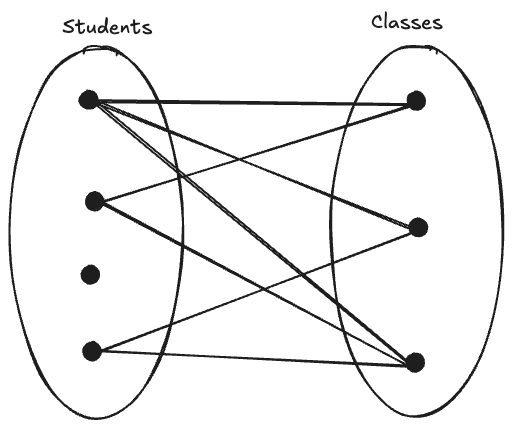

# Data Modeling

## Context

- **Why Databases?**
  - Data is ubiquitous 
  - Non-databases have critical limitations
    - Redundancy leading to poor integrity (anomalies), security, and cost
    - Structural & data dependencies

  - **DBMS**: logically related data in a single logical repository
    - Core functions include data dictionary, data storage, data transformation, security, concurrency control, backup & recover, data integrity, SQL & APIs

- **Normalization**: systematic process to tease apart distinct entities into separate tables with the main goal of minimizing data redundancy

  | Normal Form | Characteristic                               |
  | ----------- | -------------------------------------------- |
  | 1NF         | Table format, no repeating groups, PK chosen |
  | 2NF         | 1NF and no partial dependencies              |
  | 3NF         | 2NF and no transitive dependencies           |

  - **Partial dependency**: partial-PK -> non-key
    - 2NF: each *partial* dependency into separate table with original table retaining a FK to the new table
  - **Transitive dependency**: non-key -> non-key
    - 3NF: each *transitive* dependency into separate table with original table retaining a FK to the new table

> Do we always have to normalize, or can we design our data model up front in a way that controls needless redundancies?

## What is Data Modeling?

- First step in designing a database
- Creating a model (i.e. a simple representation, usually graphical) of a more complex real-world data problem
  - an **abstraction** of a real-world problem domain

  
    <sub><sup>*https://www.khoury.northeastern.edu/home/lieber/courses/se-courses/cs5500/sp11/lectures/02-Design-LawOfDemeter.pdf*</sup></sub>

- Typically an iterative, progressive process
- End result: blueprint for the database that meets all requirements
  - Possibly multiple "correct" data models
- Holistic view of the data as opposed to one department's view or the application programmer's view
  - ala the fable of the blind-folded and the elephant


<sub><sup>*https://sketchplanations.com/the-blind-and-the-elephant*</sup></sub>

## Building Blocks

1. **Entity**
2. **Attribute**
3. **Relationship**
4. **Constraint**

### Entity

- e.g. student
- a person, place, thing, concept, or event about which data will be collected and stored
- represents a unique object in the real-world
- may be a physical object or an abstract object (e.g. flight route)

### Attribute

- e.g. student email
- a characteristic of an entity

### Relationship

- e.g. a _student_ takes several _classes_
- an association among entities
- Three types:
  1. **One-to-many (1:M or 1..\*)**

       - e.g. a painter creates many paintings, but each is painted by only one painter
         - PAINTER paints PAINTING is a 1:M relationship

     

     - Other examples?
     - What about Many-to-one?
       - relationships are bidirectional
         - **one** instance of entity A is related to **many** instances of entity B
         - **one** instance of entity B is related to **one** instance of entity A

   2. **Many-to-many (M:N or \*..\*)**
     
        - e.g. a student can take many classes, and each class is taken by many students
          - STUDENT takes CLASS is a M:N relationship

          

       - Other examples?
  
  2. **One-to-one (1:1 or 1..1)**
     
     - e.g. a store is managed by one employee, and such an employee manages a single store
        - EMPLOYEE manages STORE is a 1:1 relationship

          

     - Other examples?
  
### Constraint

- e.g. a student's GPA must be between 0 and 4
- a restriction placed on the data

## Business Rules

> Business rule = a brief, precise, and unambiguous description of a policy, procedure, or principle within a specific organization

- "business" is a misnomer, "organization" would be a better name
- From a database point of view, the collection of data becomes meaningful only when it reflects properly defined business rules
  - used to define entities, attributes, relationships, and constraints
  

Examples of business rules:
- Organization = a college like LWTech
  - Rules:
    1. A *student* can take a minimum of 1 *class* and a maximum of 3 *classes* in a quarter
    2. A *class* must have at least 5 *students* enrolled
  - Model
    - entities _student_ and _class_ with a many-to-many relationship
  - Constraints
    - min/max num classes per student and min enrollment for a class
    - typically enforced in application software rather than in the database itself

To determine the relationship between 2 entities A and B, ask the following two questions:
1. *How many instances of B are related to one instance of A?*
2. *How many instances of A are related to one instance of B?*

### Naming Conventions

- Entity name
  - Should describe the entity in the organization's environment
  - Should be singular
  - e.g. STUDENT, CLASS, CUSTOMER, ...
- Attribute name
  - Should describe the entity's attribute in the organization's environment
  - Should be prefixed with the entity
  - e.g. STU_LNAME, STU_FNAME, STU_EMAIL

### Exercises

1. A patient takes medications prescribed by doctors. Write the business rules that govern the relationship between PATIENT, PRESCRIPTION, and DOCTOR.

---

## Evolution of Data Models


### Relational

- Introduced in 1970 by E. F. Codd of IBM

  

- Major breakthrough in data modeling
  - Analogous to the shift from manual transmission to automatic transmission in driving

> [!IMPORTANT]
> Key ideas:
>  1. **Based on relational algebra** in which a relation is a logical **table** of intersecting rows (**tuples** representing entities) and columns (**attributes**)
>      - Intuitive for end users
>  2. **Two entities are related to each other by sharing a common attribute**
>       - Minimal level of controlled redundancy (common attribute)
>       - Data linked via semantically meaningful attributes rather than structural links of trees/graphs
>       - Unlocks ad hoc queries from end users
>         - Powerful query language (SQL)

Example:


- Codd's work ingenious but impractical for its time
  - Simplicity required too much computational power
- Became feasible as technology advanced
- Dominant model for several decades
  - _Oracle, DB2, Microsoft SQL Server, MySQL, ..._

How is a relation/table different from a file?

A relation/table is a logical structure and provides structural independence. How the relation/table is physically stored is abstracted away from the end user.

#### RDBMS

Relational model implemented via a Relational Database Management System (RDBMS). Three main parts:
1. End-user interface
   - Allows the end user to interact with the data
1. Collection of tables stored in the database
   - All data is perceived to be stored in tables
1. SQL engine
   - Executes all queries, or data requests
   - Largely behind the scenes 

### Entity Relationship Model

- Introduced by Peter Chen in 1976
- Enhances the Relational model with a graphical representation of entities and their relationships
  - More powerful design tooling
- Entity Relationship Models (**ERM**) represented by Entity Relationship Diagrams (**ERD**)

> **Connectivity** = relationship type (1:1, 1:M, M:N)

We'll cover this in a lot of detail later. But here's a sneak peek.


#### Chen Notation

- Based on his 1976 landmark paper
- Connectivity written next to entity box
- Relationship represented by diamond connected to related entities

#### Crow's Foot Notation

- Name derived from the three-pronged symbol for "many"
- Connectivity denoted by min/max symbol pairs next to entity box (min symbol is the inner one)
- Symbols
  - open circle = 0
  - line segment = 1
  - crow's foot = many
- Relationship denoted by text on the line connecting the related entities
- You can use *mermaid* to draw Crow's Foot ERDs

  Example:
  ```
  ```mermaid
  erDiagram
    PAINTER ||--o{ PAINTING : paints
  ```

  renders as:

  ```mermaid
  erDiagram
    PAINTER ||--o{ PAINTING : paints
  ```

#### UML Notation

- Connectivity represented by lines with min/max symbols (1..1, 1..*)
- Labels both sides of the relationship

#### Exercises

1. A patient takes medications prescribed by doctors.
   
   1. Write the business rules that govern the relationship between PATIENT, PRESCRIPTION, and DOCTOR.
   2. Use the business rules to create:
      1. A Chen ERD
      2. A Crow's Foot ERD
      3. A UML ERD

### Big Data

- Emergence of **Big Data** from ubiquitous networked applications (web, social, videos, photos, maps, ...)
- Big Data characterized by **3 Vs**
  1. **Volume**: amount of data being stored
  2. **Velocity**: speed at which the data needs to be processed
  3. **Variety**: multiple, loosely-structured data formats
- RDBMS not a good fit for Big Data
  - Too restrictive a model for variety
  - Too expensive for high volume and velocity
  - Extracting information requires different approaches than a query language e.g. AI/ML
  
Big Data technologies:
1. **Hadoop**: distributed storage and computational framework
     - Originated from Google's work on distributed file systems and data processing
     - Main components:
        1. Hadoop Distributed File System (**HDFS**): manages data at high volume and velocity
        2. **MapReduce**: a framework to distribute the processing of data across computational nodes
2. **NoSQL**
      - What is it? 
        - Not based on the relational model (hence NoSQL)
          - Good for unstructured data
        - Highly distributed architectures
          - Good for scalability, availability, performance, and fault tolerance
          - Not so good for consistency
        - Handles sparse data i.e. large number of attributes with low number of instances
      - Broad umbrella for approaches, including:
        1. Key-value stores
        2. Document databases
        3. Columnar databases
        4. Graph databases

We'll study Big Data and NoSQL in more details towards the end of this course. This is the dominant paradigm in companies like Google, Facebook, Microsoft, Amazon, etc.

## Summary

1. A data model is an abstraction of a complex real-world data environment. Its basic building blocks are:
   1. Entities
   2. Attributes
   3. Relationships
   4. Constraints
2. Hierarchical and network model were early models that are no longer used
3. Relational model is the current database standard.
   1. End user perceives the data as being stored in tables
   2. Tables are related to each other by common attribute values
   3. The Entity Relationship (ER) model is a popular graphical design tool that complements the relational model
4. Big Data's high volume, velocity, and variety requires a novel approach
   1. Hadoop: distributed file system and computation
   2. NoSQL: highly distributed for scalability, availability, performance, and fault tolerance at the cost of lower consistency and more complexity in application logic
      1. Key-value
      2. Document
      3. Columnar
      4. Graph
