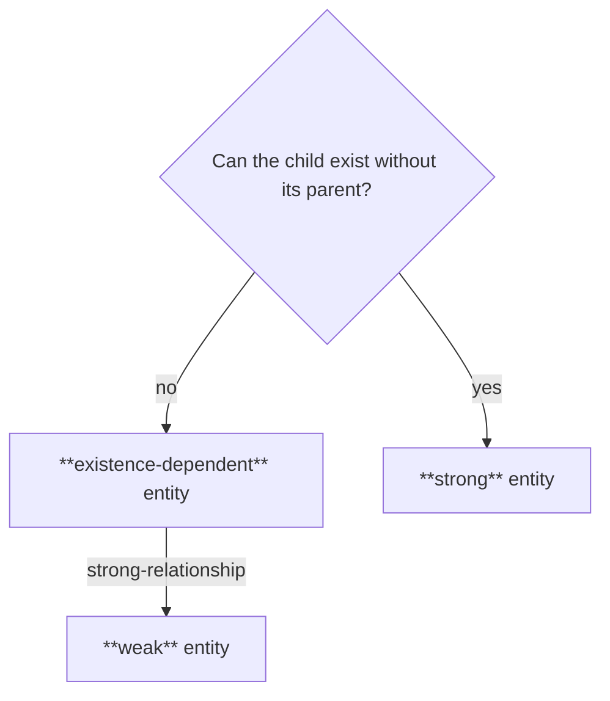
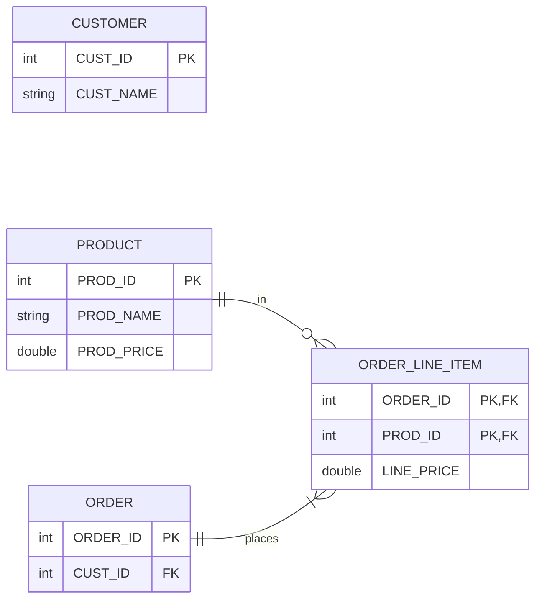
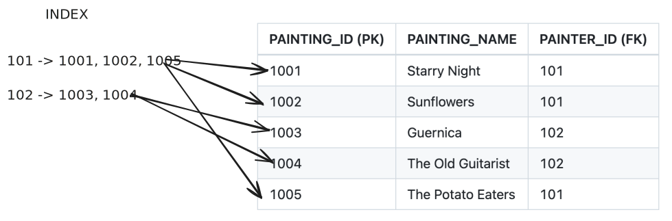

# More On Relational Database Model

## Parent-Child Entities

- When two entities are related, one of them is designated the **parent** and the other the **child**
- How?
  - Exactly one of the two related entities contains an FK attribute referring to the other entity
  - Parent: the entity without an FK to the other
  - Child: the entity with an FK to the other
  - For example, in the 1:M relationship between PAINTER and PAINTING, PAINTER is the parent and PAINTING is the child 

    ```mermaid
    erDiagram
      direction LR
      PAINTER {
        int PAINTER_ID PK
        string PAINTER_LNAME
      }
      PAINTING {
        int PAINTING_ID PK
        int PAINTER_ID FK
        string PAINTING_NAME
      }
      PAINTER ||--|{ PAINTING : paints
    ```

## Relationship Strength

- The parent-child relationship can be modeled as either **weak**/**non-identifying** or **strong**/**identifying**
- The strength is determined by whether the child's PK is chosen to be derived from the parent's PK

  ```mermaid
  flowchart TB

    identifies{Is child PK derived from parent?}
    non-identifying[**weak** or **non-identifying** relationship]
    identifying[**strong** or **identifying** relationship]

    identifies-->|no|non-identifying
    identifies-->|yes|identifying
  ```

  - PK derived from parent => strong/identifying

    ```mermaid
    erDiagram
      direction LR
      PAINTER {
        int PAINTER_ID PK
        string PAINTER_LNAME
      }
      PAINTING {
        int PAINTER_ID PK, FK
        string PAINTING_NAME PK
      }
      PAINTER ||--|{ PAINTING : paints
    ```

  - PK independent of parent => weak/non-identifying

    ```mermaid
    erDiagram
      direction LR
      PAINTER {
        int PAINTER_ID PK
        string PAINTER_LNAME
      }
      PAINTING {
        int PAINTING_ID PK
        int PAINTER_ID FK
        string PAINTING_NAME
      }
      PAINTER ||--|{ PAINTING : paints
    ```

- Whether to model a relationship as weak or strong is a design choice
  - If the child can exist without its parent then *usually* (but not necessarily) the relationship is modeled as strong, otherwise it's modeled as weak

## Existence Dependence



> An entity is **existence-dependent** if it can only exist when its related entities exist

- e.g. in the PAINTER paints PAINTING relationship, PAINTING is existence-dependent on PAINTER

  ```mermaid
  erDiagram
    direction LR
    PAINTER {
      int PAINTER_ID PK
      string PAINTER_LNAME
    }
    PAINTING {
      int PAINTING_ID PK
      int PAINTER_ID FK
      string PAINTING_NAME
    }
    PAINTER ||--|{ PAINTING : paints
  ```

- The foreign key is mandatory in an existence-dependent entity
- An existence-dependent entity is further a **weak entity** if it's in a strong relationship with the parent i.e. its PK is derived from its parent's PK
  
    ```mermaid
    erDiagram
      direction LR
      PAINTER {
        int PAINTER_ID PK
        string PAINTER_LNAME
      }
      PAINTING {
        int PAINTER_ID PK, FK
        string PAINTING_NAME PK
      }
      PAINTER ||--|{ PAINTING : paints
    ```

> An entity is **existence-independent** or a **strong entity** if it can exist apart from its related entities

- e.g. a PART is either supplied by one VENDOR or is produced in-house, and a VENDOR supplies zero or more PARTs

  ```mermaid
  erDiagram
    direction LR
    VENDOR {
      int VENDOR_ID PK
      string VENDOR_NAME
    }
    PART {
      int PART_ID PK
      string PART_NAME
      int VENDOR_ID FK
    }
    VENDOR o|--o{ PART : supplies
  ```

  - Since a PART can be produced in-house, it can exist without a VENDOR
  - The FK is optional

- Why do we care? It informs the database design to maintain referential integrity 
  - When a parent entity is deleted, all its existence-dependent children must be deleted
  - To cascade or not to cascade (we'll see later)

## Relationship Degree

> A **relationship degree** indicates the number of entities or participants in a relationship

- *unary*: 1 participant
  - aka recursive

  ```mermaid
  erDiagram
    direction LR
    EMPLOYEE o|--o{ EMPLOYEE : manages
  ```

  | EMP_ID | EMP_LNAME | TITLE               | MANAGER_ID |
  | ------ | --------- | ------------------- | ---------- |
  | 101    | Thompson  | CEO                 | NULL       |
  | 102    | Anderson  | VP Sales            | 101        |
  | 103    | Martinez  | VP Engineering      | 101        |
  | 104    | Wilson    | Sales Manager       | 102        |
  | 105    | Taylor    | Sales Rep           | 104        |
  | 106    | Brown     | Sales Rep           | 104        |
  | 107    | Johnson   | Sr. Engineer        | 103        |
  | 108    | Lee       | Jr. Engineer        | 107        |
  | 109    | Garcia    | Jr. Engineer        | 107        |
  | 110    | Davis     | Engineering Manager | 103        |


- *binary*: 2 participants
  - most common degree
  - higher degree relationships are often simplified into binary relationships

  ```mermaid
  erDiagram
    direction LR
    VENDOR o|--o{ PART : supplies
  ```

- *ternary*: 3 participants

  - e.g. a DOCTOR prescribes DRUGs to PATIENTs
  - Simplified to several binary relationships by introducing a PRESCRIPTION entity:
  
    ```mermaid
    erDiagram
      direction LR
      DOCTOR ||--o{ PRESCRIPTION : writes
      PATIENT ||--o{ PRESCRIPTION : receives
      DRUG }|--o{ PRESCRIPTION : "appears in"
    ```

- *n-degree*: n participants

### Recursive Relationships

- Relationship between instances of the same entity set
- Example: bilateral trade between countries
  - A COUNTRY can export goods to 0 or more COUNTRYs
  - A COUNTRY can import goods from 0 or more COUNTRYs

  ```mermaid
  erDiagram
    COUNTRY }o--o{ COUNTRY : exports
  ```

  - Convert the M:N into two 1:M using an associative entity

  ```mermaid
  erDiagram
    COUNTRY {
      string NAME PK
    }
    TRADE {
      string EXPORTER PK, FK
      string IMPORTER PK, FK
      double VALUE
    }
    COUNTRY ||--o{ TRADE : exports
    COUNTRY ||--o{ TRADE : imports    
  ```

Other examples:
- e.g. an EMPLOYEE is married to 0 or 1 other EMPLOYEE (1:1)
- e.g. a COURSE may be a prereq for many COURSEs and a COURSE can have many COURSEs as prereqs (M:N)


## Controlled Redundancy

Recall: a relational database makes it possible to control data redundancies by using common attributes (foreign keys) that are shared by tables.

Note:
1. Redundancies are not eliminated

    Foreign key values can be repeated many times (depending on how many entities on the "many" side are related to the "one" side entity)

1. Redundancies are reduced
2. Chances of data anomalies are reduced

Sometimes the database designer chooses to increase data redundancy e.g. to improve the performance of a query or to preserve historical accuracy.

Here's an example that illustrates an increase in redundancy. Consider the following model for an ordering system in which a customer buys one or more products in an order



Why is there a LINE_PRICE column in the ORDER_LINE_ITEM table, when there is already a PROD_PRICE column in the PRODUCT table?

To account for the fact that the price may change over time (in the PRODUCT table) but the price was fixed when the order was placed (in the ORDER_LINE_ITEM table).

## Indexes

> [!IMPORTANT]
> A database index is a structure that allows fast retrieval of rows that match the indexed attributes. 

Recall the 1:M painter paints paintings model:

  | PAINTER_ID (PK) | PAINTER_LNAME |
  | --------------- | ------------- |
  | 101             | Van Gogh      |
  | 102             | Picasso       |

  | PAINTING_ID (PK) | PAINTING_NAME     | PAINTER_ID (FK) |
  | ---------------- | ----------------- | --------------- |
  | 1001             | Starry Night      | 101             |
  | 1002             | Sunflowers        | 101             |
  | 1003             | Guernica          | 102             |
  | 1004             | The Old Guitarist | 102             |
  | 1005             | The Potato Eaters | 101             |

A common use case is to look up all paintings created by a specific painter. How can we get that information?

A full scan of the PAINTING table!

Instead, index the PAINTER_ID column in the PAINTING table to make the lookup efficient.

Logically an index consists of an index key and a set of pointers to the entities/rows identified by the index key.



**Unique indexes**: every index key has a single row associated with it.

e.g. the primary key of a table is a unique index and the last-name of a person entity is a non-unique index

Table:Index is a 1:M relationship.

The index key can be a composite key.
