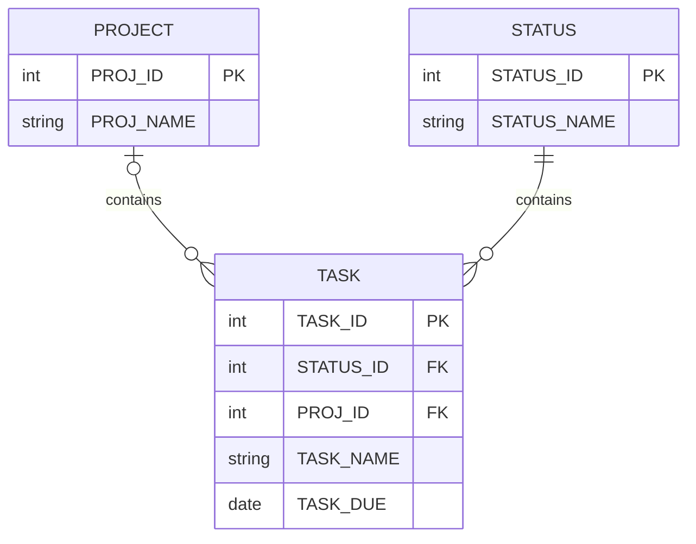

# MySQL Example Model

To illustrate how data is defined in MySQL, we need a database model. Let's use a simplified version of David Allen's Getting Things Done (GTD) system of productivity/task-management.

## ERD

## Sample Data

| STATUS_ID | STATUS_NAME |
| --------- | ----------- |
| 1         | "Next"      |
| 2         | "Waiting"   |
| 3         | "Scheduled" |
| 4         | "Someday"   |

| PROJ_ID | PROJ_NAME                  |
| ------- | -------------------------- |
| 1       | "Teach CSD 331"            |
| 2       | "Teach CS 143"             |
| 3       | "Get better at pickleball" |
| 4       | "Plan summer vacation"     |

| TASK_ID | TASK_NAME        | TASK_DUE   | STATUS_ID | PROJ_ID |
| ------- | ---------------- | ---------- | --------- | ------- |
| 1       | "Buy milk"       | null       | 1         | null    |
| 2       | "Prep next quiz" | 04/15/2025 | 3         | 1       |
| 3       | "Prep next quiz" | 04/15/2025 | 3         | 2       |
| 4       | "Amazon package" | null       | 2         | 3       |

---