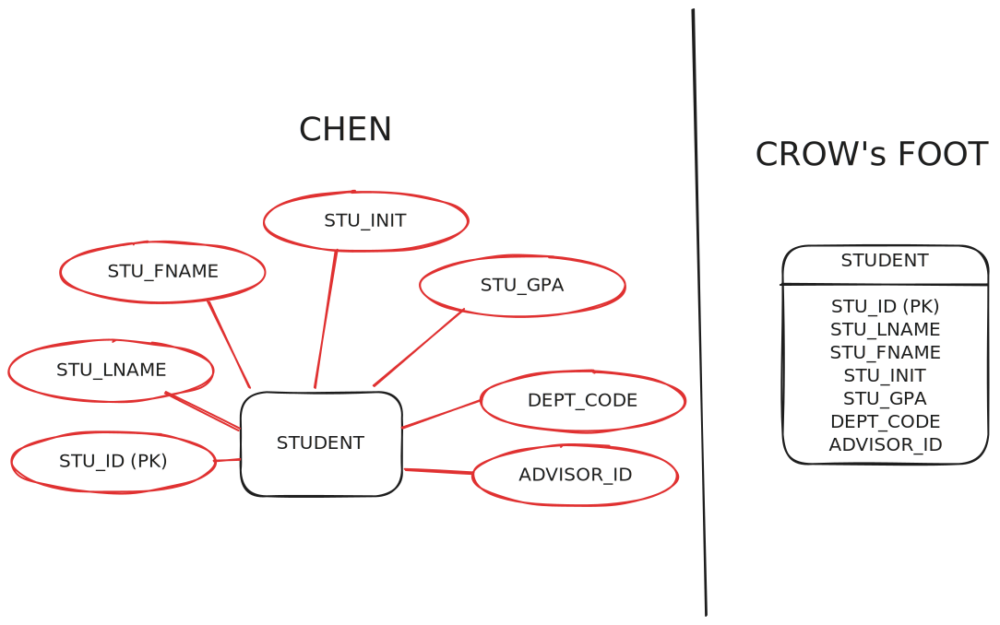
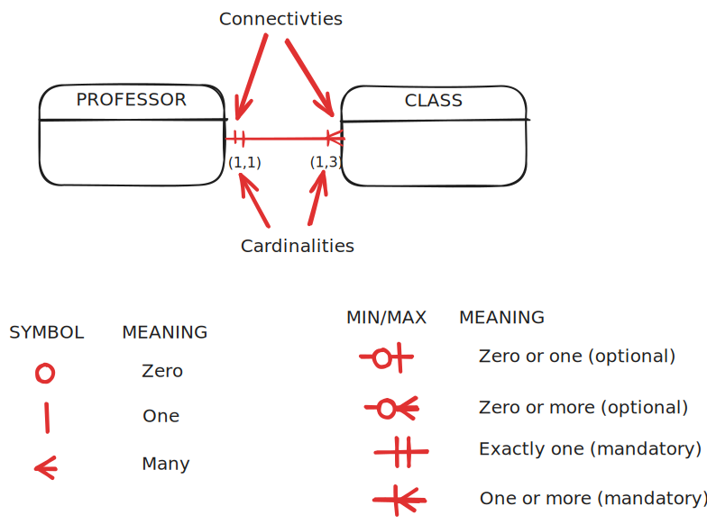

# Relational Database Model

---

## Context: What is the Relational Model?

**Two Key Points:**

1. **Based on relational algebra**
   - A relation (entity) = table of intersecting rows (tuples) and columns (attributes)

2. **Tables are related by sharing common attributes**

**Enhancement:**
- Entity Relationship Model (ERM) adds graphical design notation (e.g., crow's foot)

> In this course: *Relational Model* = *Entity Relationship Model* = *ERM*

---

## Tables: The Foundation

- **Relation** (mathematical) → **Table** (persistent storage)
  - Codd used these terms interchangeably
  
- A table contains a group of related entity instances (**entity set**)
  
- Table view makes it easy to spot and define entity relationships

---

## Characteristics of a Relational Table

1. 2D structure: rows and columns
2. Each **row** (tuple) = one **entity instance** (record)
3. Each **column** = one **attribute** (field) with distinct name
4. Row-column intersection = single data value (also a **1NF** requirement)

5. All values in a column:
   - Have same data format
   - Drawn from the **attribute domain**
6. Order of rows/columns is immaterial (logically)
7. At least one attribute (or combination) **uniquely identifies each row** (also a **1NF** requirement)

> A table in at least 1NF is a relational table!

---

<!-- _class: compact -->

## Example: Student Table

| STU_ID | STU_LNAME | STU_FNAME | STU_INIT | STU_GPA | DEPT_CODE | ADVISOR_ID |
| ------ | --------- | --------- | -------- | ------- | --------- | ---------- |
| 10001  | Martinez  | Carlos    | A        | 3.45    | CS        | 201        |
| 10002  | Johnson   | Emily     | R        | 3.82    | MATH      | 205        |
| 10003  | Chen      | David     | L        | 3.67    | CS        | 201        |
| 10004  | Williams  | Sarah     | M        | 3.91    | BIO       | 210        |
| 10005  | Anderson  | Michael   | J        | 3.28    | ENG       | 215        |

---

## Related Table: Advisors

<!-- _class: compact -->

| ADVISOR_ID | ADV_LNAME | ADV_FNAME | ADV_INIT | DEPT_CODE | ADV_OFFICE | ADV_PHONE    | ADV_EMAIL                |
| ---------- | --------- | --------- | -------- | --------- | ---------- | ------------ | ------------------------ |
| 201        | Thompson  | Robert    | K        | CS        | SCI-312    | 555-234-5678 | rthompson@university.edu |
| 205        | Patel     | Anjali    | S        | MATH      | MATH-208   | 555-234-5692 | apatel@university.edu    |
| 210        | Garcia    | Maria     | L        | BIO       | BIO-105    | 555-234-5703 | mgarcia@university.edu   |
| 215        | Brown     | James     | D        | ENG       | ENG-421    | 555-234-5715 | jbrown@university.edu    |

**Note:** ADVISOR_ID connects these tables!

---

## Keys: Definition

> A **key** consists of one or more attributes that _determine_ other attributes.

**Example:**
- STU_ID determines all other student attributes
- STU_ID → (STU_LNAME, STU_FNAME, STU_INIT, STU_GPA, DEPT_CODE, ADVISOR_ID)

This is **functional dependence** (from Normalization)

---

## Key Terminology: Structure

1. **Simple key**: consists of ONE attribute
   - e.g., STU_ID or ADVISOR_ID

2. **Composite key**: consists of MULTIPLE attributes
   - e.g., (STU_LNAME, STU_FNAME, STU_INIT)
   
3. **Key attribute**: an attribute that is part of a key
   - e.g., STU_LNAME or STU_FNAME or STU_INIT (when part of composite)

---

## Key Terminology: Row Identification

**Hierarchy:**

- **Super Key**: uniquely identifies one row
  - e.g., (STU_ID) or (STU_ID, STU_LNAME) or (STU_LNAME, STU_FNAME, STU_INIT)

  - **Candidate Key**: irreducible Super Key
    - e.g., (STU_ID) or (STU_LNAME, STU_FNAME, STU_INIT)
    - NOT (STU_ID, STU_LNAME) ← reducible!

    - **Primary Key (PK)**: the chosen candidate key
      - e.g., (STU_ID)

---

## More Key Types

**Surrogate Key**: 
- Primary key created by designer
- Does NOT correspond to real-world attribute
- Examples: STU_ID, ADVISOR_ID
- Why use surrogate keys?
  <small>
  - No identifying attribute exists naturally
  - Existing attribute inappropriate (e.g., SSN)
  - DBMS efficient at generating unique IDs
  </small>

**Foreign Key (FK)**: 
- Attribute(s) that is the primary key of a related table
- e.g., ADVISOR_ID in Students table

**Secondary Key** (index key):
- For efficient/convenient retrieval
- e.g., STU_LNAME

---

## Integrity Rules

A valid relational table MUST satisfy:

### 1. Entity Integrity
- All primary key entries are **unique**. Why?
- No part of primary key is **null**. Why?

### 2. Referential Integrity
- Every **non-null** foreign key value must reference an **existing** primary key in the related table. Why?

---

## 🎯 Active Learning: Check Integrity

Do these tables satisfy Entity and Referential Integrity?

**Students table:** STU_ID (PK), ADVISOR_ID (FK)
**Advisors table:** ADVISOR_ID (PK)

**Verify:**
1. Are all PKs unique and non-null?
2. Do all FK values reference existing PKs?

**Discuss in pairs for 2 minutes**

---

## Entity

- An **object of interest** in the model
- Corresponds to a **table** (entity set), not a row
- **Notation:** Rectangle containing entity name
  - Name is a **noun**
  - Convention: UPPERCASE with underscore

---

## Attribute

- A **characteristic** of an entity

**Notation:**
- **Chen:** Oval with attribute name connected to entity
- **Crow's Foot:** Listed in entity rectangle below name

**Conventions:**
- Required attributed indicated by **bold** 
- PK attributes indicated by
  - **Underline** or
  - **PK** notation next to attributes
- FK attributes indicated by **FK** notated next to attributes

---

## Multivalued Attributes

**Problem:** Attributes with multiple values for same entity
- e.g., multiple phone numbers, multiple colors

**Two Implementation Approaches:**

1. **Decompose** into separate attributes
   - STU_HOMEPHONE, STU_CELLPHONE, STU_WORKPHONE
   - ❌ Brittle if number of values changes

2. **Create new entity** with 1:M relationship
   - ✅ Flexible and scalable

---

## Multivalued Attributes: Approach 1

**Decompose into separate attributes:**

| STU_ID (PK) | STU_HOMEPHONE | STU_CELLPHONE | STU_WORKPHONE |
| ----------- | ------------- | ------------- | ------------- |
| 10001       | 555-123-4567  | NULL          | 555-345-6789  |
| 10002       | NULL          | 555-876-5432  | 555-345-6789  |

**Issues:**
- Many NULL values
- Fixed number of phone types
- Hard to add new types

---

<!-- _class: compact -->

## Multivalued Attributes: Approach 2

**Create new entity with 1:M relationship:**

**STUDENT table:**
| STU_ID (PK) |
| ----------- |
| 10001       |
| 10002       |

**STUDENT_PHONE table:**
| STU_ID (PK,FK) | PHONE_TYPE (PK) | PHONE_NUMBER |
| -------------- | --------------- | ------------ |
| 10001          | home            | 555-123-4567 |
| 10001          | work            | 555-345-6789 |
| 10002          | cell            | 555-876-5432 |
| 10002          | work            | 555-345-6789 |

✅ **Flexible and scalable!**

---

## Relationships

- An **association** between entities
- **Participant**: entity in the relationship
- **Name**: verb (active or passive)
  - Active: STUDENT *takes* CLASS
  - Passive: CLASS *is taken by* STUDENT

**Bi-directional:** Must know in both directions
- One A relates to how many B's?
- One B relates to how many A's?

---

## Relationship Properties

**Connectivity:** Type of relationship
- 1:1 (one-to-one)
- 1:M (one-to-many)
- M:N (many-to-many)

**Cardinality:** Min/max occurrences (constraints)
- Notated as (min, max) beside entity

---

## 1:M Relationship Example

**Business Rule:**
- A painter paints one or more paintings
- A painting is painted by exactly one painter

---

## 1:M: Foreign Key Placement

**Question:** Where does the FK go?

**Option 1 - WRONG ❌:** FK in PAINTER table (the "one" side)
| PAINTER_ID (PK) | PAINTER_LNAME | PAINTING_ID (PK, FK) |
| --------------- | ------------- | -------------------- |
| 101             | Van Gogh      | 1001                 |
| 101             | Van Gogh      | 1002                 |
| 101             | Van Gogh      | 1005                 |

**Problems:** 
1. Redundant painter data
2. PAINTER_ID no longer unique

---

## 1:M: Foreign Key Placement (cont.)

**Option 2 - CORRECT ✅:** FK in PAINTING table (the "many" side)

| PAINTING_ID (PK) | PAINTING_NAME     | PAINTER_ID (FK) |
| ---------------- | ----------------- | --------------- |
| 1001             | Starry Night      | 101             |
| 1002             | Sunflowers        | 101             |
| 1003             | Guernica          | 102             |
| 1004             | The Old Guitarist | 102             |
| 1005             | The Potato Eaters | 101             |

> **Rule:** PK of "one" side → FK in "many" side

---

## 🎯 Active Learning: 1:M Practice

**Scenario:**
- A department has many courses
- A course belongs to exactly one department

**Questions:**
1. Draw the crow's foot notation
2. Which table gets the foreign key?
3. What would happen if you put the FK in the wrong table?

---

## 1:1 Relationship Example

**Business Rule:**
- A professor optionally chairs at most one department
- A department is chaired by exactly one professor

---

## 1:1: Foreign Key Placement

**Question:** Where does FK go in 1:1 relationship?

**Option 1 - WRONG ❌:** FK in PROFESSOR (mandatory side)
| PROF_ID (PK) | PROF_LNAME  | CHAIR_DEPT_ID (FK) |
| ------------ | ----------- | ------------------ |
| 301          | Smith       | NULL               |
| 302          | Johnson     | 402                |
| 303          | Khemani     | NULL               |
| 304          | Guerra Hahn | 401                |

**Problem:** Many NULL values!

---

## 1:1: Foreign Key Placement (cont.)

**Option 2 - CORRECT ✅:** FK in DEPARTMENT (optional side)

| DEPT_ID (PK) | DEPT_NAME        | CHAIR_PROF_ID (FK) |
| ------------ | ---------------- | ------------------ |
| 401          | Computer Science | 304                |
| 402          | Mathematics      | 302                |

**No NULL values!**

> **Rule:** In 1:1 with one optional entity, PK of "mandatory" side → FK in "optional" side

---

## 1:1: Both Sides Mandatory

**When both entities are mandatory:**
- Either table can contain the FK
- Choose based on other factors (e.g., additional relationships)

**Example:**

PROFESSOR has FK to DEPARTMENT (for "contains" relationship)
DEPARTMENT has FK to PROFESSOR (for "chairs" relationship)

---

## M:N Relationship Example

**Business Rule:**
- A student takes many classes
- A class is taken by many students

**Problem:** M:N relationships are NOT directly supported in relational model!

---

## M:N: Why Not Directly Supported?

**Wrong implementation ❌:**

| CLASS_CODE (PK) | CLASS_ROOM | STU_ID (FK) |
| --------------- | ---------- | ----------- |
| CS101           | Room 201   | 501         |
| CS101           | Room 201   | 502         |
| MA201           | Room 105   | 501         |
| MA201           | Room 105   | 502         |

**Problem:** Massive redundancy! CLASS_ROOM repeated for every student.

---

## M:N: The Solution

**Create a composite (bridge/associative/junction) entity**

**ENROLLMENT entity:**
- Contains FKs to both tables
- PK options:
  1. (FK1, FK2) ← composite key
  2. Separate surrogate PK

---

<!-- _class: compact -->

## M:N: Complete Example

**STUDENT table:**
| STU_ID (PK) | STU_LNAME |
| ----------- | --------- |
| 501         | Miller    |
| 502         | Davis     |

**CLASS table:**
| CLASS_CODE (PK) | CLASS_ROOM |
| --------------- | ---------- |
| CS101           | Room 201   |
| MA201           | Room 105   |

**ENROLLMENT table:**
| STU_ID (PK,FK) | CLASS_CODE (PK,FK) |
| -------------- | ------------------ |
| 501            | CS101              |
| 501            | MA201              |
| 502            | CS101              |

---

## 🎯 Active Learning: Design Challenge

**Scenario:**
- An author writes many books
- A book can have many authors (co-authored)

**Tasks:**
1. What type of relationship is this?
2. Can it be directly implemented?
3. Design the solution with table names and key attributes
4. Draw the ERD

---

## Relationship Verb Guidelines

**1:M relationships:**
- "One" side is subject of verb
- Read from "one" to "many"

**1:1 relationships:**
- If one optional: mandatory side is subject
- If both mandatory: follow logical/business dependency

**Example verbs:**
- Active: paints, teaches, manages, contains
- Passive: is painted by, is taught by, is managed by

---

## Summary: Key Takeaways

1. **Tables** = entities with rows (tuples) and columns (attributes)
2. **Keys** uniquely identify rows; FKs connect related tables
3. **Integrity rules** ensure data validity
4. **1:M:** FK goes in "many" side
5. **1:1:** FK goes in "optional" side (if one optional)
6. **M:N:** Requires composite/bridge entity

---

<!-- _class: compact -->

## Practice Exercise: Complete Database

Given these tables:

| REGION_ID | REGION_NAME | STORE_ID | STORE_NAME | REGION_ID |
| --------- | ----------- | -------- | ---------- | --------- |
| 1001      | West Coast  | 2001     | Downtown   | 1001      |
| 1002      | East Coast  | 2002     | Hillside   | 1001      |

| STORE_ID | STORE_NAME | REGION_ID |
| -------- | ---------- | --------- |
| 2001     | Downtown   | 1001      |
| 2002     | Hillside   | 1001      |

| EMP_ID | EMP_LNAME | STORE_ID |
| ------ | --------- | -------- |
| 3001   | Anderson  | 2001     |
| 3002   | Brown     | 2001     |

**Questions:**
1. Identify all PKs and FKs
2. Check entity and referential integrity
3. Draw a crow's foot ERD showing the entity relationships

---

## Tools for Drawing ERDs

**Free Recommendations:**
1. **Mermaid** - embedded in markdown
2. **Excalidraw** - web-based drawing
3. **Lucidchart** - professional diagrams
4. **MySQL Workbench** - database-specific

**Practice using at least one tool for your assignments!**

---

