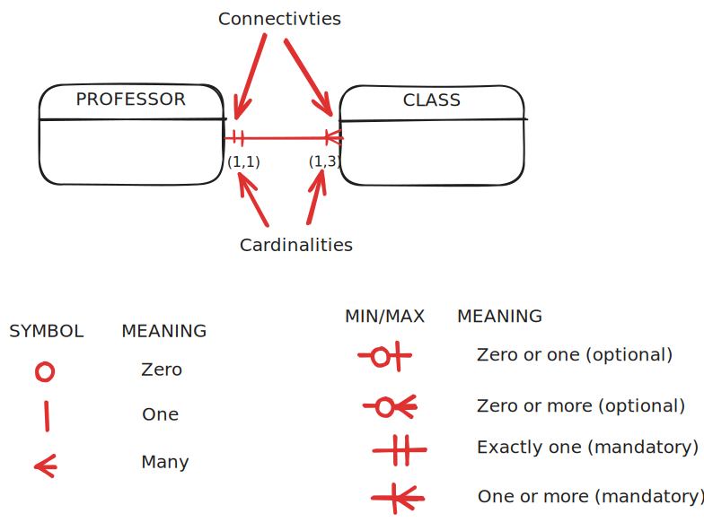

# Relational Database Model

## Context

We have briefly discussed the Relational Database Model when we talked about the evolution of data models [here](modeling.md#relational).

Recall the two key points about the Relational Model :

  1. **Based on relational algebra** in which a relation (entity) is a table of intersecting rows (tuples) and columns (attributes)
  2. **Two tables (entities) are related to each other by sharing a common attribute**

Also recall that the Entity Relationship Model (ERM) complements/enhances the Relational Model by defining a graphical design notation (e.g. crow's foot) and tool.

> [!IMPORTANT]
> In this course we won't distinguish between the Relational Model and the Entity Relationship enhancement to that model. Instead we'll use the terms *Relational/Entity-Relationship/ERM* interchangeably.

## Tables

- From relational algebra, a **relation** (not to be confused with a relationship) is a mathematical construct whose persistent (storable) representation is a  **table**
  - Codd used 'relation' and 'table' interchangeably
  - We'll mainly use 'table' to refer to both
- A table contains a group of related entity instances (aka **entity set**)
  - We'll use 'table' and 'entity set' interchangeably
- A table view of data makes it easy to spot and define entity relationships (as we'll see later)

### Characteristics of a Relational Table

1. 2D structure composed of rows and columns
2. Each **row** (**tuple**) represents one **entity instance** in the entity set
   1. Sometimes also referred to as **record** from files terminology (though beware that a table is logical and a file is physical)
3. Each **column** represents an **attribute** of the entity set and has a distinct name
   1. Sometimes also referred to as **field** from files terminology
4. Each intersection of a row and a column represents a single data value.
5. All values in a column:
   1. Have the same data format
   2. Are drawn from the **attribute domain**
6. The order of rows and columns is immaterial to the model
   1. Though does matter for the internal and physical abstractions
7. There's at least one attribute or combination of attributes that **uniquely identifies each row**

### Exercise 

Example relational table for the entity set of students:

| STU_ID | STU_LNAME | STU_FNAME | STU_INIT | STU_GPA | DEPT_CODE | ADVISOR_ID |
| ------ | --------- | --------- | -------- | ------- | --------- | ---------- |
| 10001  | Martinez  | Carlos    | A        | 3.45    | CS        | 201        |
| 10002  | Johnson   | Emily     | R        | 3.82    | MATH      | 205        |
| 10003  | Chen      | David     | L        | 3.67    | CS        | 201        |
| 10004  | Williams  | Sarah     | M        | 3.91    | BIO       | 210        |
| 10005  | Anderson  | Michael   | J        | 3.28    | ENG       | 215        |


1. How many rows/tuples/entity-instances?
2. How many columns/attributes?
3. What does each row/tuple represent?
4. What is the format and attribute domain of the column STU_GPA?
5. Which attribute(s) uniquely identifies each row?

Example related table of student advisors:

| ADVISOR_ID | ADV_LNAME | ADV_FNAME | ADV_INIT | DEPT_CODE | ADV_OFFICE | ADV_PHONE    | ADV_EMAIL                |
| ---------- | --------- | --------- | -------- | --------- | ---------- | ------------ | ------------------------ |
| 201        | Thompson  | Robert    | K        | CS        | SCI-312    | 555-234-5678 | rthompson@university.edu |
| 205        | Patel     | Anjali    | S        | MATH      | MATH-208   | 555-234-5692 | apatel@university.edu    |
| 210        | Garcia    | Maria     | L        | BIO       | BIO-105    | 555-234-5703 | mgarcia@university.edu   |
| 215        | Brown     | James     | D        | ENG       | ENG-421    | 555-234-5715 | jbrown@university.edu    |

## Keys

> A **key** consists of one or more attributes that _determine_ other attributes.

Recall [functional dependence](normalization.md#functional-dependence) from Normalization.

Example: 
- STU_ID is a key that determines all other attributes of a student 
  - STUD_ID -> (STU_LNAME, STU_FNAME, STU_INIT, STU_GPA, DEPT_CODE, ADVISOR_ID) 


Terminology:

1. Structure
   1. **Simple key**: a key that consists of one attribute
     
      e.g. STU_ID or ADVISOR_ID

   2. **Composite key**: a key that consists of more than one attribute

      e.g. (STU_LNAME, STU_FNAME, STU_INIT)
        - **Key attribute**: attribute that is part of a key 

          e.g. STU_LNAME or STU_FNAME or STU_INIT

2. Row identification       

   1. Uniquely identify a row in a table
  
      - Hierarchy: 
        - **Super Key**: uniquely identifies one row

          e.g. (STU_ID) or (STU_ID, STU_LNAME) or (STU_LNAME, STU_FNAME, STU_INIT)

          - **Candidate Key**: an irreducible Super Key

            e.g. (STU_ID) or (STU_LNAME, STU_FNAME, STU_INIT), but not (STU_ID, STU_LNAME)

            - **Primary Key (PK)**: the chosen candidate key

              e.g. (STU_ID)

       - **Surrogate key**: a primary key created by the database designer that does not correspond to an attribute in the real-world being modeled

          e.g. STU_ID or ADVISOR_ID 

         Why surrogate key? For example:

         - An identifying attribute does not exist (e.g. students)
         - An existing identifying attribute is not appropriate (e.g. social-security)
         - DBMS good at generating unique ids for an entity
  

   2. Uniquely identify a row in a related table

      - **Foreign Key (FK)**: attribute(s) that is the primary key of a related table
        
          e.g. (ADVISOR_ID) in the Students table is a FK to the Advisors table

   3. Identify zero or more rows in a table (for efficient/convenient retrieval)

      - **Secondary Key** (aka index key) 

         e.g. (STU_LNAME)

## Integrity Rules

A valid relational table must satisfy:

1. **Entity Integrity**
   1. All primary key entries are unique (otherwise the key does not identify a row)
   2. No part of a primary key is null (otherwise the key is not irreducible)
2. **Referential Integrity**
   - Every non-null foreign key value _must_ reference an _existing_ primary key value in the related table

How do the following tables satisfy the above integrity rules?

| STU_ID | STU_LNAME | STU_FNAME | STU_INIT | STU_GPA | DEPT_CODE | ADVISOR_ID |
| ------ | --------- | --------- | -------- | ------- | --------- | ---------- |
| 10001  | Martinez  | Carlos    | A        | 3.45    | CS        | 201        |
| 10002  | Johnson   | Emily     | R        | 3.82    | MATH      | 205        |
| 10003  | Chen      | David     | L        | 3.67    | CS        | 201        |
| 10004  | Williams  | Sarah     | M        | 3.91    | BIO       | 210        |
| 10005  | Anderson  | Michael   | J        | 3.28    | ENG       | 215        |


| ADVISOR_ID | ADV_LNAME | ADV_FNAME | ADV_INIT | DEPT_CODE | ADV_OFFICE | ADV_PHONE    | ADV_EMAIL                |
| ---------- | --------- | --------- | -------- | --------- | ---------- | ------------ | ------------------------ |
| 201        | Thompson  | Robert    | K        | CS        | SCI-312    | 555-234-5678 | rthompson@university.edu |
| 205        | Patel     | Anjali    | S        | MATH      | MATH-208   | 555-234-5692 | apatel@university.edu    |
| 210        | Garcia    | Maria     | L        | BIO       | BIO-105    | 555-234-5703 | mgarcia@university.edu   |
| 215        | Brown     | James     | D        | ENG       | ENG-421    | 555-234-5715 | jbrown@university.edu    |

## Entity

- An **object of interest** in the model of the real-world
- Corresponds to a **table** (entity set) rather than a row (entity instance)
- Notation (common to Chen, Crow, UML)
  - **Rectangle** that contains the entity's name
    - name: a **noun**
      - convention: uppercase with underscore as separator


## Attribute

- A characteristic of an entity
- Notation
  - Chen: oval containing attribute name connected to the entity rectangle by a line
  - Crow: listed in the entity rectangle below the entity name
  
  

  - Sometimes required vs optional attributes are differentiated by bolding required attributes
  - Sometime primary keys are designated by underlining the key attributes or by notating a 'PK' next to the attribute
    - Note that all key attributes are required (entity integrity) and so key attributes are both bolded and underlined

### Multivalued Attributes

> attributes that can have multiple values for the same entity instance
  - e.g. several phone numbers for a household or colors of the different parts of a car
  - Such attributes must be implemented in one of two possible ways
  
    1. Decompose into several attributes, one for each component of the multivalued attribute e.g. STU_HOMEPHONE, STU_CELLPHONE, STU_WORKPHONE

        Entity:
        ```mermaid
        erDiagram
          STUDENT {
            int STU_ID PK
            string STU_HOMEPHONE
            string STU_CELLPHONE
            string STU_WORKPHONE
          }
        ```

        Sample table:
        | STU_ID (PK) | STU_HOMEPHONE | STU_CELLPHONE | STU_WORKPHONE |
        | ----------- | ------------- | ------------- | ------------- |
        | 10001       | 555-123-4567  | NULL          | 555-345-6789  |
        | 10002       | NULL          | 555-876-5432  | 555-345-6789  |

        This is kind of brittle e.g. if the number of components changes

    2. Create a new entity composed of the components of the multivalued attribute. The original entity has a 1:M relationship with the new entity.

        Entity-Relationshiop-Diagram (ERD):
        ```mermaid
        erDiagram
          STUDENT {
            int STU_ID PK
          }
          STUDENT_PHONE {
            int STU_ID PK,FK
            string PHONE_TYPE PK
            string PHONE_NUMBER
          }
          STUDENT ||--o{ STUDENT_PHONE : has
        ```

        Sample related tables:

        | STU_ID (PK) |
        | ----------- |
        | 10001       |
        | 10002       |


        | STU_ID (PK, FK) | PHONE_TYPE (PK) | PHONE_NUMBER |
        | --------------- | --------------- | ------------ |
        | 10001           | home            | 555-123-4567 |
        | 10001           | work            | 555-345-6789 |
        | 10002           | cell            | 555-876-5432 |
        | 10002           | work            | 555-345-6789 |


## Relationship

- An association between entities
- **Participant**: entity that participates in a relationship
- Each relationship identified by a name
  - verb
    - active e.g. STUDENT *takes* a CLASS
    - passive e.g. A CLASS *is taken* by a STUDENT
- A relationship is bi-directional i.e. need to know in both directions.
  - One instance of entity A is related to how many instances of entity B?
  - One instance of entity B is related to how many instances of entity A?

**Connectivity**: the type of relationship
  - 1:1
  - 1:M
  - M:N

**Cardinality**: the specific minimum and maximum number of entity occurrences associated with one occurrence of the related entity. Typically a constraint e.g. GPA between 0.0 and 4.0
  - Notated as (min, max) beside the entity
  - If there are no constraints, crow's foot notation already captures min/max values from among 0, 1, infinity via circle, line, crow's foot respectively (with min being the inner symbol and max being the outer symbol)



### 1:M

Example:
- A painter paints one or more paintings
- A painting is painted by exactly one painter
  


#### Foreign Key

- The Painter and Painting entities are related
- So one of them must have a _foreign key_ (FK) attribute
- Which one? Painter or Painting?

  | PAINTER_ID (PK) | PAINTER_LNAME |
  | --------------- | ------------- |
  | 101             | Van Gogh      |
  | 102             | Picasso       |

  | PAINTING_ID (PK) | PAINTING_NAME     |
  | ---------------- | ----------------- |
  | 1001             | Starry Night      |
  | 1002             | Sunflowers        |
  | 1003             | Guernica          |
  | 1004             | The Old Guitarist |
  | 1005             | The Potato Eaters |


- If Painter (the "1" side) had a FK to Painting (the "many" side) then it would have to store multiple FKs for one painter => redundantly storing the painter

  | PAINTER_ID (PK) | PAINTER_LNAME | PAINTING_ID (FK) ❌ |
  | --------------- | ------------- | ------------------ |
  | 101             | Van Gogh      | 1001               |
  | 101             | Van Gogh      | 1002               |
  | 101             | Van Gogh      | 1005               |
  | 102             | Picasso       | 1003               |
  | 102             | Picasso       | 1004               |

- So Painting stores a FK to Painter

| PAINTING_ID (PK) | PAINTING_NAME     | PAINTER_ID (FK) ✅ |
| ---------------- | ----------------- | ----------------- |
| 1001             | Starry Night      | 101               |
| 1002             | Sunflowers        | 101               |
| 1003             | Guernica          | 102               |
| 1004             | The Old Guitarist | 102               |
| 1005             | The Potato Eaters | 101               |

> The primary key of the "one" side is put as a foreign key into the "many" side, in a 1:M relationship

Here's an ERD illustration:


### 1:1

Example:
- A Professor optionally chairs at most one Department
- A Department is chaired by exactly one Professor


  
#### Foreign Key

| PROF_ID (PK) | PROF_LNAME  |
| ------------ | ----------- |
| 301          | Smith       |
| 302          | Johnson     |
| 303          | Khemani     |
| 304          | Guerra Hahn |

| DEPT_ID (PK) | DEPT_NAME        |
| ------------ | ---------------- |
| 401          | Computer Science |
| 402          | Mathematics      |

- Which table should contain the FK?
- If Professor (the mandatory side), then many professors will have a null FK (since most professors don't chair departments)

  | PROF_ID (PK) | PROF_LNAME  | CHAIR_DEPT_ID (FK) ❌ |
  | ------------ | ----------- | -------------------- |
  | 301          | Smith       | NULL                 |
  | 302          | Johnson     | 402                  |
  | 303          | Khemani     | NULL                 |
  | 304          | Guerra Hahn | 401                  |

- So FK in the optional Department side

  | DEPT_ID (PK) | DEPT_NAME        | CHAIR_PROF_ID (FK) ✅ |
  | ------------ | ---------------- | -------------------- |
  | 401          | Computer Science | 304                  |
  | 402          | Mathematics      | 302                  |

> In a 1:1 relationship in which one entity is optional, the primary key of the "mandatory" side is put as a foreign key into the "optional" side

Here's an ERD illustration:


> In a 1:1 relationship in which both entities are mandatory, either table can contain the FK. The choice depends on other factors (e.g. additional relationships)

For example, there's an additional relationship between Professor and Department:


So, Professor (the "many" side in this relationship) must contain a FK to the Department they belong to. This nudges us to put the FK for the 1:1 professor-chairs-department relationship in Department.


Here's a table illustration:

  | PROF_ID (PK) | PROF_LNAME  | DEPT_ID (FK) |
  | ------------ | ----------- | ------------ |
  | 301          | Smith       | 402          |
  | 302          | Johnson     | 402          |
  | 303          | Khemani     | 401          |
  | 304          | Guerra Hahn | 401          |

  | DEPT_ID (PK) | DEPT_NAME        | CHAIR_PROF_ID (FK) |
  | ------------ | ---------------- | ------------------ |
  | 401          | Computer Science | 304                |
  | 402          | Mathematics      | 302                |

- **A note about the relationship verb:** 
  - In a 1:M relationship, the "one" side is the subject of the verb i.e. read the relationship from the "one" side to the "many" side
  - In a 1:1 relationship
    - If one entity is optional and the other mandatory, the mandatory side is the subject of the verb
    - Otherwise, just follow the logical/business dependency to choose which side is the subject

### M:N

> An M:N relationship is not directly supported in a relational model. However it can be modeled by creating a **new entity that is in a 1:M relationship with the other two entities**.

Consider the following M:N example:


- Why can't this be directly modeled?
  - For the same reason that in a 1:M relationship the "many" side contains a FK to the "one" side. Otherwise there will be needless redundancy (repetition of rows with all attributes except FK the same).
  - The **wrong** implementation of M:N relationships:

  | STU_ID (PK) | STU_LNAME | CLASS_CODE |
  | ----------- | --------- | ---------- |
  | 501         | Miller    | CS101      |
  | 501         | Miller    | MA201      |
  | 501         | Miller    | ENG102     |
  | 502         | Davis     | CS101      |
  | 502         | Davis     | MA201      |
  | 502         | Davis     | HIS210     |

  | CLASS_CODE (PK) | CLASS_ROOM | STU_ID (FK) ❌ |
  | --------------- | ---------- | ------------- |
  | CS101           | Room 201   | 501           |
  | CS101           | Room 201   | 502           |
  | MA201           | Room 105   | 501           |
  | ENG102          | Room 303   | 501           |
  | MA201           | Room 105   | 502           |
  | HIS210          | Room 220   | 502           |

- So what's this new associative/junction entity that makes things right?
  - A **composite** (or **bridge** or **associative** or **junction**) entity
  - It includes FKs for the two M:N entities
  - What is its PK? Two valid choices:
    1. (FK1, FK2)
    2. Separate PK  

Here's the composite entity, Enrollment, for the Student/Class M:N relationship:


Here are the entities with their key attributes:


Finally, here are the tables:

| STU_ID (PK) | STU_LNAME |
| ----------- | --------- |
| 501         | Miller    |
| 502         | Davis     |

| CLASS_CODE (PK) | CLASS_ROOM |
| --------------- | ---------- |
| CS101           | Room 201   |
| MA201           | Room 105   |
| ENG102          | Room 303   |
| HIS210          | Room 220   |

| STU_ID (PK, FK1) | CLASS_CODE (PK, FK2) |
| ---------------- | -------------------- |
| 501              | CS101                |
| 501              | MA201                |
| 501              | ENG102               |
| 502              | CS101                |
| 502              | MA201                |
| 502              | HIS210               |


## Exercises

1. Consider the following tables in a database:

    | REGION_ID | REGION_NAME |
    | --------- | ----------- |
    | 1001      | West Coast  |
    | 1002      | East Coast  |

    | STORE_ID | STORE_NAME     | REGION_ID |
    | -------- | -------------- | --------- |
    | 2001     | Downtown Plaza | 1001      |
    | 2002     | Hillside Mall  | 1001      |
    | 2003     | Harbor Center  | 1002      |
    | 2004     | City Square    | 1002      |

    | EMP_ID | EMP_LNAME | STORE_ID |
    | ------ | --------- | -------- |
    | 3001   | Anderson  | 2001     |
    | 3002   | Brown     | 2001     |
    | 3003   | Chen      | 2002     |
    | 3004   | Davis     | 2002     |
    | 3005   | Evans     | 2003     |
    | 3006   | Foster    | 2003     |
    | 3007   | Garcia    | 2004     |
    | 3008   | Harris    | 2004     |

   1. For each table, identify the primary key and the foreign key(s). If a table does not have a foreign key, write None.

   2. Do the tables exhibit entity integrity? Answer yes or no, and then explain your answer.

   3. Do the tables exhibit referential integrity? Answer yes or no, and then explain your answer. Write NA (Not Applicable) if the table does not have a foreign key.

   4. Describe the type(s) of relationship(s) between STORE and REGION.

   5. Create the ERD to show the relationship between STORE and REGION.

   6. Create the relational diagram to show the relationship between STORE and REGION.

   7. Describe the type(s) of relationship(s) between EMPLOYEE and STORE. (Hint: Each store employs many employees, one of whom manages the store.)

   8. Create the ERD to show the relationships among EMPLOYEE, STORE, and REGION.

   9. Create the relational diagram to show the relationships among EMPLOYEE, STORE, and REGION.

## Aside: Tools

Here are some free tool recommendations to draw ERDs:

1. Mermaid (embedded in markdown)
2. Excalidraw
3. Lucidchart
4. MySQL Workbench
